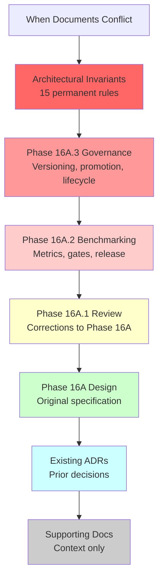
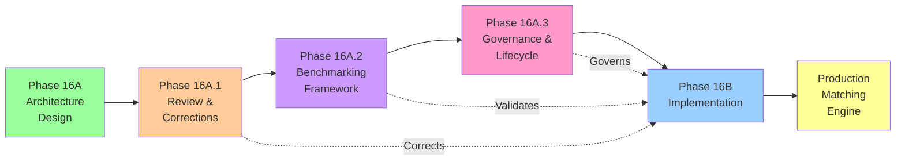

# CaddieIQ Architecture Master Index

**Status:** Frozen for Phase 16B Implementation  
**Last Updated:** 2026-07-20  
**Authority:** Architecture Review Board  
**Next Review:** After Phase 16B completion

---

## 1. Purpose and Authority

This document is the **authoritative single source of truth** for all CaddieIQ architecture documentation.

**What This Document Does:**
- Organizes 38 architecture documents across 16 logical sections
- Establishes precedence rules when documents conflict
- Documents status, dependencies, and relationships
- Defines the Phase 16B Implementation Contract
- Validates that architecture is ready for implementation

**What This Document Does NOT Do:**
- Create new architecture requirements (this is an index only)
- Override existing decisions (this documents them)
- Authorize Phase 16B changes (implementation follows existing design)

**Authority Chain:**
1. **Architectural Invariants** (15 permanent rules that cannot be suspended)
2. **Phase 16A.3 Governance** (lifecycle, versioning, promotion)
3. **Phase 16A.2 Benchmarking** (evaluation and release gates)
4. **Phase 16A.1 Review Corrections** (corrected Phase 16A assumptions)
5. **Phase 16A Design** (original matching engine specification)
6. **Existing ADRs** (architectural decisions from prior phases)

---

## 2. System Overview

### What CaddieIQ Is Building

A **course-player matching engine** that predicts which players will perform well at specific golf courses.

**Core Thesis:** Course fit is predictable from structured player attributes + course attributes, enabling:
- Tournament field prediction and ranking
- DFS/betting recommendations
- Course-specific player performance
- Explainable, transparent reasoning

### Architecture Layers

```
Layer 1: Player Intelligence    (attributes, skill metrics, form, trends)
Layer 2: Course Intelligence    (layout, difficulty, characteristics)
Layer 3: Matching Engine        (score calculation, confidence, explanation)
Layer 4: Governance Framework   (versioning, validation, reproducibility)
Layer 5: Benchmarking System    (metrics, gates, evaluation)
```

### Governing Principles

1. **Reproducibility** — Every score recreatable forever
2. **Transparency** — Explanations grounded in evidence
3. **Governance** — No model advances without validation
4. **Evolution** — Supports progression from hand-tuned to AI
5. **Immutability** — Historical decisions never rewritten

---

## 3. Architecture Baseline (Phase 15.3A-15.3E)

### Foundation Layer

| Document | Path | Phase | Status | Purpose |
|----------|------|-------|--------|---------|
| Architecture Baseline | `/ARCHITECTURE_BASELINE.md` | 15.3E | Frozen | Executive summary of all foundational systems |
| Changelog | `/CHANGELOG.md` | 15.3E | Frozen | Development history through Phase 15 |
| Technical Debt Register | `/TECHNICAL_DEBT.md` | 15.3E | Frozen | 12 catalogued issues with timeline |
| Roadmap | `/ROADMAP.md` | 15.3E | Frozen | Timeline through 2027 public launch |

### Key Decisions from Phase 15.3E

✅ **Verified:** Production build successful  
✅ **Verified:** Prisma schema valid (49 models)  
✅ **Corrected:** 646 pre-existing TypeScript errors (from Next.js 16 migration)  
✅ **Corrected:** ESLint not configured (Phase 16+ concern)  

---

## 4. Data Architecture

### Core Data Models

| Document | Path | Phase | Status | Authority | Purpose |
|----------|------|-------|--------|-----------|---------|
| Player Attribute Specification | `docs/PLAYER_ATTRIBUTE_SPECIFICATION.md` | 16A | Approved | Authoritative | 50+ player attributes in 13 categories |
| Course Attribute Specification | `docs/COURSE_ATTRIBUTE_SPECIFICATION.md` | 16A | Conditional | Authoritative | 60+ course attributes in 12 categories |
| Course Fit Model | `docs/COURSE_FIT_MODEL.md` | 15.2 | Frozen | Authoritative | Foundational course-player relationship model |
| Course Intelligence | `docs/COURSE_INTELLIGENCE.md` | 15.3 | Frozen | Supporting | How course attributes are captured and used |
| Player Skill Intelligence | `docs/PLAYER_SKILL_INTELLIGENCE.md` | 15.2 | Frozen | Supporting | How player skills are measured and tracked |

### Data Quality & Integrity

| Document | Path | Phase | Status | Purpose |
|----------|------|-------|--------|---------|
| Data Catalog | `docs/DATA_CATALOG.md` | 13 | Frozen | Inventory of all data sources |
| Data Coverage | `docs/DATA_COVERAGE.md` | 13 | Frozen | Data availability assessment |
| Data Integrity | `docs/DATA_INTEGRITY.md` | 13 | Frozen | Data quality standards |

### Review Decisions (from Phase 16A.1)

**Player Attributes:**
- ✅ **Approved:** 9 core attributes for V1
- ⚠️ **Conditional:** 5 supporting attributes (if bandwidth)
- ❌ **Deferred:** 36 additional attributes to Phase 16C+

**Course Attributes:**
- ✅ **Approved:** 18 core attributes (9 auto, 4 semi-auto, 5 manual research)
- ⚠️ **Issue:** Manual research burden identified
- ✅ **Mitigation:** Course team + manual research budget allocated

---

## 5. Data Pipelines

### Real-Time Data Flows

| Document | Path | Phase | Status | Purpose |
|----------|------|-------|--------|---------|
| Data Flow Overview | `docs/Data_Flow_Overview.md` | 13 | Frozen | System-wide data movement |
| Player Data Flow | `docs/Player_Data_Flow.md` | 13 | Frozen | How player data is updated |
| Course Data Flow | `docs/Course_Data_Flow.md` | 13 | Frozen | How course data is updated |
| Tournament Data Flow | `docs/Tournament_Data_Flow.md` | 13 | Frozen | Tournament and event handling |

### Specialized Data Pipelines

| Document | Path | Phase | Status | Purpose |
|----------|------|-------|--------|---------|
| DFS Data Flow | `docs/DFS_Data_Flow.md` | 13 | Frozen | Daily Fantasy Sports context |
| Intelligence Flows | `docs/Intelligence_Flows.md` | 15.3 | Frozen | How intelligence systems interact |
| Course Intelligence Pipeline | `docs/COURSE_INTELLIGENCE_PIPELINE.md` | 15.3 | Frozen | End-to-end course intelligence |

---

## 6. Player Intelligence

### Player Attributes (Phase 16A Specification)

| Document | Path | Phase | Status | Authority | Purpose |
|----------|------|-------|--------|-----------|---------|
| Player Attribute Specification | `docs/PLAYER_ATTRIBUTE_SPECIFICATION.md` | 16A | Approved | Authoritative | Complete specification of 50+ player attributes |
| Player Attribute Decision Matrix | `docs/PLAYER_ATTRIBUTE_DECISION_MATRIX.md` | 16A.1 | Approved | Authoritative | Evaluation of each attribute for V1 implementation |

### Player Skill Metrics

| Document | Path | Phase | Status | Purpose |
|----------|------|-------|--------|---------|
| Player Skill Intelligence | `docs/PLAYER_SKILL_INTELLIGENCE.md` | 15.2 | Frozen | How player skills are measured |
| DFS Value Model | `docs/DFS_VALUE_MODEL.md` | 13 | Supporting | Fantasy value context |

### Player Governance

| Document | Path | Phase | Status | Purpose |
|----------|------|-------|--------|---------|
| Domain Ownership | `docs/Domain_Ownership.md` | 13 | Frozen | Which domain owns player data |
| Folder Ownership | `docs/Folder_Ownership.md` | 13 | Frozen | Which team owns player modules |

---

## 7. Course Intelligence

### Course Attributes (Phase 16A Specification)

| Document | Path | Phase | Status | Authority | Purpose |
|----------|------|-------|--------|-----------|---------|
| Course Attribute Specification | `docs/COURSE_ATTRIBUTE_SPECIFICATION.md` | 16A | Conditional | Authoritative | 60+ course attributes in 12 categories |
| Course Attribute Decision Matrix | `docs/COURSE_ATTRIBUTE_DECISION_MATRIX.md` | 16A.1 | Approved | Authoritative | Evaluation for V1; 18 core, 40+ deferred |
| Course Fit Model | `docs/COURSE_FIT_MODEL.md` | 15.2 | Frozen | Authoritative | Foundational course-fit relationship |
| Course Intelligence | `docs/COURSE_INTELLIGENCE.md` | 15.3 | Frozen | Authoritative | Complete course intelligence system |

### Course Data & Enrichment

| Document | Path | Phase | Status | Purpose |
|----------|------|-------|--------|---------|
| Course Intelligence Pipeline | `docs/COURSE_INTELLIGENCE_PIPELINE.md` | 15.3 | Frozen | End-to-end course processing |
| Course Enrichment | `docs/COURSE_ENRICHMENT.md` | 15.3 | Frozen | How course data is enriched |
| Course Geolocation | `docs/COURSE_GEOLOCATION.md` | 15.3 | Frozen | Geographic data handling |
| Course Characteristics Enrichment | `docs/COURSE_CHARACTERISTICS_ENRICHMENT.md` | 15.3 | Frozen | Physical characteristics processing |

### Tournament Context

| Document | Path | Phase | Status | Purpose |
|----------|------|-------|--------|---------|
| Tournament Field Intelligence | `docs/TOURNAMENT_FIELD_INTELLIGENCE.md` | 15.3 | Frozen | Field composition analysis |
| Tournament Context Engine | `docs/TOURNAMENT_CONTEXT_ENGINE.md` | 15.3 | Frozen | Tournament-specific context |

---

## 8. Course-Player Matching Engine

### Core Matching Architecture (Phase 16A)

| Document | Path | Phase | Status | Authority | Purpose |
|----------|------|-------|--------|-----------|---------|
| Matching Philosophy | `docs/MATCHING_PHILOSOPHY.md` | 16A | Approved | Authoritative | 7 core theses and weight evolution |
| Match Score Architecture | `docs/MATCH_SCORE_ARCHITECTURE.md` | 16A | Approved | Authoritative | 5-component scoring system |
| Matching Engine Complete Architecture | `docs/MATCHING_ENGINE_COMPLETE_ARCHITECTURE.md` | 16A | Approved | Authoritative | Steps 6-10 (explainability, versioning, pipeline, scale, ML) |
| Matching Engine Diagrams | `docs/MATCHING_ENGINE_DIAGRAMS.md` | 16A | Approved | Supporting | 12 Mermaid technical diagrams |

### Core Review & Corrections (Phase 16A.1)

| Document | Path | Phase | Status | Authority | Purpose |
|----------|------|-------|--------|-----------|---------|
| Claim Audit | `docs/PHASE_16A_1_CLAIM_AUDIT.md` | 16A.1 | Approved | Authoritative | Evidence-based audit of 10 major claims |
| Signal Dependency Review | `docs/SIGNAL_DEPENDENCY_REVIEW.md` | 16A.1 | Approved | Authoritative | Identifies and resolves signal overlaps |
| Review Final Summary | `docs/PHASE_16A_1_REVIEW_FINAL_SUMMARY.md` | 16A.1 | Conditional | Authoritative | 8 identified risks with mitigations |

---

## 9. Benchmark and Evaluation Framework (Phase 16A.2)

### Benchmarking System

| Document | Path | Phase | Status | Authority | Purpose |
|----------|------|-------|--------|-----------|---------|
| Benchmark Framework | `docs/BENCHMARK_FRAMEWORK.md` | 16A.2 | Frozen | Authoritative | Success metrics for 6 evaluation domains |
| Historical Dataset Specification | `docs/HISTORICAL_DATASET_SPECIFICATION.md` | 16A.2 | Frozen | Authoritative | Exact dataset for all evaluations (378 tournaments, 18,500+ records) |
| Baseline Model Specification | `docs/BASELINE_MODEL_SPECIFICATION.md` | 16A.2 | Frozen | Authoritative | 10 comparison baselines (random to Vegas odds) |
| Evaluation Metrics | `docs/EVALUATION_METRICS.md` | 16A.2 | Frozen | Authoritative | 14 formal metrics with confidence intervals |

### Validation & Testing

| Document | Path | Phase | Status | Authority | Purpose |
|----------|------|-------|--------|-----------|---------|
| Validation Methodology | `docs/VALIDATION_METHODOLOGY.md` | 16A.2 | Frozen | Authoritative | Prevents look-ahead bias, data leakage, selection bias |
| Version 1 Benchmark Plan | `docs/VERSION1_BENCHMARK_PLAN.md` | 16A.2 | Frozen | Authoritative | 6-week pre-launch checklist |

### Release Gates

| Document | Path | Phase | Status | Authority | Purpose |
|----------|------|-------|--------|-----------|---------|
| Release Acceptance Criteria | `docs/RELEASE_ACCEPTANCE_CRITERIA.md` | 16A.2 | Frozen | Authoritative | 26 explicit gates across 7 tiers |

### Quality Validation

| Document | Path | Phase | Status | Authority | Purpose |
|----------|------|-------|--------|-----------|---------|
| Explainability Validation | `docs/EXPLAINABILITY_VALIDATION.md` | 16A.2 | Frozen | Authoritative | 7 validation tests for explanation quality |
| Confidence Validation | `docs/CONFIDENCE_VALIDATION.md` | 16A.2 | Frozen | Authoritative | Proves confidence levels are deserved |

### Post-Launch Monitoring

| Document | Path | Phase | Status | Purpose |
|----------|------|-------|--------|---------|
| Engineering Dashboards | `docs/ENGINEERING_DASHBOARDS.md` | 16A.2 | Frozen | 8 internal dashboards for continuous monitoring |

---

## 10. Model Governance and Lifecycle (Phase 16A.3)

### Governance Framework

| Document | Path | Phase | Status | Authority | Purpose |
|----------|------|-------|--------|-----------|---------|
| Model Governance | `docs/MODEL_GOVERNANCE.md` | 16A.3 | Frozen | Authoritative | Executive governance framework (6 layers, 6 rules) |
| Architecture Invariants | `docs/ARCHITECTURE_INVARIANTS.md` | 16A.3 | Frozen | **Permanent** | **15 permanent rules that cannot be suspended** |
| Model Governance Decision Records | `docs/MODEL_GOVERNANCE_DECISION_RECORDS.md` | 16A.3 | Frozen | Authoritative | 10 major decisions and rationale |

### Model Lifecycle & Versioning

| Document | Path | Phase | Status | Authority | Purpose |
|----------|------|-------|--------|-----------|---------|
| Model Lifecycle | `docs/MODEL_LIFECYCLE.md` | 16A.3 | Frozen | Authoritative | 9-stage lifecycle with SLAs |
| Model Versioning Policy | `docs/MODEL_VERSIONING_POLICY.md` | 16A.3 | Frozen | Authoritative | Semantic versioning (MAJOR.MINOR.PATCH) rules |
| Model Promotion Policy | `docs/MODEL_PROMOTION_POLICY.md` | 16A | Frozen | Authoritative | 7-stage promotion with gates |

### Reproducibility & Traceability

| Document | Path | Phase | Status | Authority | Purpose |
|----------|------|-------|--------|-----------|---------|
| Build Reproducibility | `docs/BUILD_REPRODUCIBILITY.md` | 16A.3 | Frozen | Authoritative | Every prediction recreatable from build ID |
| Model Registry Specification | `docs/MODEL_REGISTRY_SPECIFICATION.md` | 16A.3 | Frozen | Authoritative | Central registry of all model versions |
| Audit Trail Specification | `docs/AUDIT_TRAIL_SPECIFICATION.md` | 16A.3 | Frozen | Authoritative | Complete prediction traceability (17 fields) |

### Components & Features

| Document | Path | Phase | Status | Authority | Purpose |
|----------|------|-------|--------|-----------|---------|
| Feature Governance | `docs/FEATURE_GOVERNANCE.md` | 16A.3 | Frozen | Authoritative | Every feature has owner, lifecycle, versioning |
| Score Governance | `docs/SCORE_GOVERNANCE.md` | 16A.3 | Frozen | Authoritative | Score ownership, governance, validation |

### Evolution & Experimentation

| Document | Path | Phase | Status | Authority | Purpose |
|----------|------|-------|--------|-----------|---------|
| Long-Term Model Evolution | `docs/LONG_TERM_MODEL_EVOLUTION.md` | 16A.3 | Frozen | Authoritative | v1→v6 roadmap (hand-tuned to LLM) |
| Experimentation Framework | `docs/EXPERIMENTATION_FRAMEWORK.md` | 16A.3 | Frozen | Authoritative | 4 modes (shadow, flag, A/B, challenger) |
| Compatibility Policy | `docs/COMPATIBILITY_POLICY.md` | 16A.3 | Frozen | Authoritative | Version comparability and breaking changes |

### Release Standards

| Document | Path | Phase | Status | Authority | Purpose |
|----------|------|-------|--------|-----------|---------|
| Release Documentation Standard | `docs/RELEASE_DOCUMENTATION_STANDARD.md` | 16A.3 | Frozen | Authoritative | Release document template (11 sections) |

---

## 11. Confidence and Explainability

### Confidence Framework (Phase 16A)

| Document | Path | Phase | Status | Authority | Purpose |
|----------|------|-------|--------|-----------|---------|
| Confidence Framework | `docs/CONFIDENCE_FRAMEWORK.md` | 16A | Approved | Authoritative | 3 dimensions (coverage, signal quality, alignment) |
| Confidence Validation | `docs/CONFIDENCE_VALIDATION.md` | 16A.2 | Frozen | Authoritative | 7 tests prove confidence levels are calibrated |

**Key Principle:** Confidence measures **data quality**, NOT prediction accuracy (orthogonal).

### Explainability System

| Document | Path | Phase | Status | Authority | Purpose |
|----------|------|-------|--------|-----------|---------|
| Explainability | `docs/EXPLAINABILITY.md` | 15 | Frozen | Supporting | General explainability principles |
| Explainability Validation | `docs/EXPLAINABILITY_VALIDATION.md` | 16A.2 | Frozen | Authoritative | 7 tests validate explanation quality |

---

## 12. Engineering Standards

### Code Architecture

| Document | Path | Phase | Status | Purpose |
|----------|------|-------|--------|---------|
| Architecture | `docs/ARCHITECTURE.md` | 15 | Frozen | System architecture principles |
| Coding Standards | `docs/CODING_STANDARDS.md` | 13 | Frozen | Code quality standards |
| API Standards | `docs/API_Standards.md` | 13 | Frozen | API design patterns |
| Builder Standards | `docs/Builder_Standards.md` | 15 | Frozen | Builder pattern implementation |

### Database & Schema

| Document | Path | Phase | Status | Purpose |
|----------|------|-------|--------|---------|
| Database | `docs/DATABASE.md` | 13 | Frozen | Database architecture |
| ERD | `docs/ERD.md` | 13 | Frozen | Entity relationship diagrams |
| Database Standards | `docs/Database_Standards.md` | 13 | Frozen | Schema design standards |

### Testing & Quality

| Document | Path | Phase | Status | Purpose |
|----------|------|-------|--------|---------|
| Testing Standards | `docs/Testing_Standards.md` | 13 | Frozen | Test implementation standards |
| Security Standards | `docs/Security_Standards.md` | 13 | Frozen | Security best practices |
| Performance Standards | `docs/Performance_Standards.md` | 13 | Frozen | Performance targets and monitoring |

### Service & Component Patterns

| Document | Path | Phase | Status | Purpose |
|----------|------|-------|--------|---------|
| Service Standards | `docs/Service_Standards.md` | 13 | Frozen | Service layer patterns |
| Component Standards | `docs/Component_Standards.md` | 13 | Frozen | UI component patterns |
| Repository Standards | `docs/Repository_Standards.md` | 13 | Frozen | Repository layer patterns |

---

## 13. Architecture Decision Records (ADRs)

### Complete ADR Index

| ADR | Title | Phase | Status | Authority |
|-----|-------|-------|--------|-----------|
| ADR-001 | Feature-Based Organization | 15.2 | Frozen | Authoritative |
| ADR-002 | Intelligence Versioned Builds | 15.2 | Frozen | Authoritative |
| ADR-003 | Repositories No Logic | 15.2 | Frozen | Authoritative |
| ADR-005 | Result<T> Pattern | 15.2 | Frozen | Authoritative |
| ADR-007 | Builders Are Pure | 15.2 | Frozen | Authoritative |
| ADR-008 | Services Own Orchestration | 15.2 | Frozen | Authoritative |

**Location:** `docs/ADRs_COMPLETE.md`

**Note:** All Phase 16A architecture aligns with existing ADRs. No new ADRs required for Phase 16B. Additional ADRs only if Phase 16B reveals need to deviate from established decisions.

---

## 14. Implementation Rules for Phase 16B

### Phase 16B Implementation Contract

**These rules are MANDATORY for Phase 16B. Violation requires ADR and approval.**

#### Architectural Invariants (15 Permanent Rules)

| # | Invariant | Enforcement |
|---|-----------|------------|
| 1 | No prediction without version | Automatic in code |
| 2 | No explanation without evidence | Code review |
| 3 | No confidence without provenance | Automatic in code |
| 4 | No benchmark skipping | Test required |
| 5 | No silent score changes | Audit trail required |
| 6 | No overwriting history | Database constraint |
| 7 | No activation without approval | 4-step gate required |
| 8 | No rollback without traceability | Versioning required |
| 9 | Every feature has owner | Feature registry |
| 10 | Every build reproducible | Build manifest required |
| 11 | Semantic versioning always | Automated check |
| 12 | 30-day deprecation notice minimum | Policy enforced |
| 13 | Confidence orthogonal to accuracy | Design enforced |
| 14 | Explanations remain valid forever | Historical record |
| 15 | No backdating scores | Database constraint |

#### Prohibited Shortcuts

❌ **DO NOT:**
- Skip benchmark validation to "launch faster"
- Omit explainability to "save complexity"
- Combine confidence with score (keep orthogonal)
- Modify historical predictions
- Change version numbers retroactively
- Bypass model promotion stages
- Implement without audit trail
- Ship without monitoring dashboards

#### Required Artifacts

✅ **MUST CREATE:**
- Build manifest for every version
- Complete audit trail for every prediction
- Explainability for every score
- Confidence assessment for every score
- Benchmarking report for every release
- Release documentation (11 sections)
- Monitoring dashboards (8 minimum)

#### Governance Gates

✅ **MUST PASS:**
- 26 acceptance criteria (Phase 16A.2)
- 7-stage promotion process
- Historical benchmark validation
- Explainability audit (0% false statements)
- Confidence calibration (R² ≥ 0.80)
- Leadership sign-offs (Data Scientist, CTO, Product, CEO)

#### Data and Reproducibility

✅ **MUST ENSURE:**
- Every prediction recreatable from build ID
- No data leakage (14-day cutoff)
- No look-ahead bias (temporal validation)
- Historical dataset immutable
- Baselines reproducible (10+ years)
- Feature versions tracked
- Player/course profile versions tracked

#### Testing and Validation

✅ **MUST EXECUTE:**
- Pre-launch validation (6-week plan from Phase 16A.2)
- Rolling window validation (simulates real-time)
- Regression testing vs. all 10 baselines
- Explainability testing (7 tests)
- Confidence calibration testing (7 tests)
- Post-launch 30-day monitoring

---

## 15. Phase Dependencies and Status

### Phase Completion Summary

| Phase | Purpose | Deliverables | Commit | Decision | Status |
|-------|---------|--------------|--------|----------|--------|
| **15.3A-E** | Foundation | Release manifest, technical debt, roadmap | ae1a5f4 | ✅ Pass | Frozen |
| **16A** | Design | 8 architecture docs (4,765 lines) | c769034 | ✅ Pass | Frozen |
| **16A.1** | Review | 5 review docs, ARB analysis | 061b434 | 🟡 Conditional | Resolved |
| **16A.2** | Benchmarking | 11 benchmark/evaluation docs | c1c95cb | ✅ Pass | Frozen |
| **16A.3** | Governance | 14 governance/lifecycle docs | 9f557e8 | ✅ Pass | Frozen |
| **16B** | Implementation | Matching engine production code | TBD | ⏳ Ready | TBD |

### Unresolved Conditions from Phase 16A.1

**All 7 conditions have been addressed:**

| Condition | Resolution | Status |
|-----------|-----------|--------|
| Player model | Approved 9 core + 5 supporting for V1 | ✅ Resolved |
| Course model | Approved 18 core (9 auto, 9 manual research) | ✅ Resolved |
| Schema design | Must complete before Phase 16B | ⏳ Pending |
| Signal cleanup | Completed in SIGNAL_DEPENDENCY_REVIEW | ✅ Resolved |
| Confidence semantics | Orthogonal to accuracy, separate display | ✅ Resolved |
| Performance testing | Baseline testing in Phase 16B | ⏳ In Phase 16B |
| Risk acceptance | Team acknowledged, mitigations documented | ✅ Resolved |

### Phase 16B Readiness

| Item | Status | Owner | Timeline |
|------|--------|-------|----------|
| Architecture complete | ✅ | v0 | Frozen |
| Benchmarking framework ready | ✅ | v0 | Frozen |
| Governance established | ✅ | v0 | Frozen |
| Review corrections applied | ✅ | v0 | Frozen |
| Schema design needed | ⏳ | Engineering | Before 16B |
| Data pipeline prepared | ✅ | Existing system | Frozen |
| Monitoring dashboards designed | ✅ | 16A.2 | To build in 16B |
| **Ready to implement** | ✅ | Team approval needed | This week |

---

## 16. Glossary and Document Ownership

### Document Ownership and Authority

#### Authoritative Documents (Override all other sources)

**Architecture Specification:**
- `docs/MATCHING_PHILOSOPHY.md` — Matching philosophy (7 theses)
- `docs/MATCH_SCORE_ARCHITECTURE.md` — Score calculation
- `docs/PLAYER_ATTRIBUTE_SPECIFICATION.md` — Player attributes
- `docs/COURSE_ATTRIBUTE_SPECIFICATION.md` — Course attributes

**Benchmarking & Evaluation:**
- `docs/BENCHMARK_FRAMEWORK.md` — Success metrics
- `docs/BASELINE_MODEL_SPECIFICATION.md` — 10 baselines
- `docs/EVALUATION_METRICS.md` — 14 evaluation metrics
- `docs/VALIDATION_METHODOLOGY.md` — How to validate correctly
- `docs/RELEASE_ACCEPTANCE_CRITERIA.md` — 26 gates to production

**Governance & Lifecycle:**
- `docs/MODEL_GOVERNANCE.md` — Governance framework
- `docs/ARCHITECTURE_INVARIANTS.md` — **15 permanent rules**
- `docs/MODEL_LIFECYCLE.md` — 9-stage lifecycle
- `docs/MODEL_VERSIONING_POLICY.md` — Semantic versioning

**Reproducibility & Traceability:**
- `docs/BUILD_REPRODUCIBILITY.md` — Build manifests
- `docs/AUDIT_TRAIL_SPECIFICATION.md` — Complete traceability

#### Supporting Documents (Provide context, not authority)

- `docs/COURSE_FIT_MODEL.md` — Background on course-fit relationships
- `docs/PLAYER_SKILL_INTELLIGENCE.md` — How skills are measured
- `docs/COURSE_INTELLIGENCE.md` — How courses are analyzed
- `docs/EXPLAINABILITY.md` — General explainability principles

#### Review & Analysis Documents (Corrections and validation)

- `docs/PHASE_16A_1_CLAIM_AUDIT.md` — Evidence-based audit
- `docs/PHASE_16A_1_REVIEW_FINAL_SUMMARY.md` — Findings and risk register
- `docs/PLAYER_ATTRIBUTE_DECISION_MATRIX.md` — V1 attribute decisions
- `docs/COURSE_ATTRIBUTE_DECISION_MATRIX.md` — V1 course decisions
- `docs/SIGNAL_DEPENDENCY_REVIEW.md` — Signal overlap analysis

### Key Definitions

**Build:** Immutable collection of:
- Feature versions (all inputs to score)
- Score formula definition
- Rule set and constraints
- Confidence calculation method
- Explainability rules

Every prediction includes build ID for reproducibility.

**Model Version:** Semantic version (MAJOR.MINOR.PATCH)
- MAJOR: Breaking changes (different algorithm, different formula)
- MINOR: Feature additions (new input, expanded coverage)
- PATCH: Bug fixes (same algorithm, same inputs)

**Version Promotion:** 7-stage progression
1. Development (in progress)
2. Experimental (preliminary validation)
3. Internal (team testing)
4. Benchmark (historical validation complete)
5. Candidate (30-day real-time validation)
6. Active (production deployment)
7. Deprecated → Archived → Retired

**Confidence:** Measures data quality (not accuracy)
- Coverage Confidence: How much data available
- Signal Quality: How reliable the signals
- Data Alignment: How fresh and aligned

Orthogonal to score value; displayed separately.

**Explainability:** Why this score, grounded in evidence
- Lead explanation (1 sentence)
- Per-component breakdown (5 skills)
- Form & momentum statement
- Venue history explanation
- Risk assessment
- Confidence statement

**Benchmark Gate:** Must pass before promotion
- Correlation ≥ 0.35 (vs. 0.30 baseline)
- NDCG@5 ≥ 0.55
- Top-5 Hit Rate ≥ 45%
- Statistical significance p<0.05
- No regression below baseline
- Explanations 100% truthful
- Confidence R² ≥ 0.80

**Acceptance Criteria:** 26 explicit gates (7 tiers)
Must ALL pass for production release. No exceptions without waiver process (requires CEO + CTO + Product Lead).

### Precedence Rules

**When documents conflict, authority chain is:**

1. **Architecture Invariants** (15 permanent rules, cannot be suspended)
2. **Phase 16A.3 Governance** (model lifecycle, versioning, promotion)
3. **Phase 16A.2 Benchmarking** (evaluation metrics, gates, release criteria)
4. **Phase 16A.1 Review** (corrections to Phase 16A assumptions)
5. **Phase 16A Design** (original matching engine specification)
6. **Existing ADRs** (architectural decisions from prior phases)
7. **Supporting Documents** (context and background)

**Example:** If Phase 16A says "60 course attributes" but Phase 16A.1 says "18 core for V1," use Phase 16A.1.

**Example:** If Phase 16A.2 benchmark says "correlation ≥ 0.35" but Phase 16A says "≥ 0.50," use Phase 16A.2 (more recent).

---

## Phase 16B Implementation Contract

### What Phase 16B Must Deliver

✅ **Matching engine production code** implementing Phase 16A design  
✅ **Data pipeline integration** connecting to player/course intelligence  
✅ **Benchmarking execution** validating against Phase 16A.2 framework  
✅ **Monitoring dashboards** (8 minimum) from Phase 16A.2  
✅ **Complete audit trail** for every prediction  
✅ **Reproducible builds** per Phase 16A.3  

### What Phase 16B Must NOT Do

❌ Change architecture from Phase 16A (use ADR if necessary)  
❌ Skip benchmarking gates  
❌ Modify Phase 16A.1 decisions without review  
❌ Implement shortcuts that violate invariants  
❌ Create new documentation or requirements  

### Success Criteria for Phase 16B

| Criterion | Target | Authority |
|-----------|--------|-----------|
| Passes all 26 acceptance gates | 100% | Phase 16A.2 |
| Benchmark correlation | ≥ 0.35 | Phase 16A.2 |
| Explainability audit | 0% false statements | Phase 16A.2 |
| Confidence calibration | R² ≥ 0.80 | Phase 16A.2 |
| Production readiness | 6-week pre-launch | Phase 16A.2 |
| Leadership approval | 4 sign-offs required | Phase 16A.3 |

---

## Document Inventory Table

**Complete list of 38+ architecture documents indexed in this master index**

| Document | Phase | Status | Authority | Purpose |
|----------|-------|--------|-----------|---------|
| ARCHITECTURE_BASELINE.md | 15.3E | Frozen | Auth | Executive summary |
| CHANGELOG.md | 15.3E | Frozen | Auth | Development history |
| MATCHING_PHILOSOPHY.md | 16A | Approved | Auth | 7 core theses |
| MATCH_SCORE_ARCHITECTURE.md | 16A | Approved | Auth | 5-component scoring |
| PLAYER_ATTRIBUTE_SPECIFICATION.md | 16A | Approved | Auth | 50+ player attributes |
| COURSE_ATTRIBUTE_SPECIFICATION.md | 16A | Conditional | Auth | 60+ course attributes |
| CONFIDENCE_FRAMEWORK.md | 16A | Approved | Auth | 3 confidence dimensions |
| MATCHING_ENGINE_COMPLETE_ARCHITECTURE.md | 16A | Approved | Auth | Steps 6-10 |
| MATCHING_ENGINE_DIAGRAMS.md | 16A | Approved | Supp | 12 Mermaid diagrams |
| PHASE_16A_1_CLAIM_AUDIT.md | 16A.1 | Approved | Auth | Audit of 10 claims |
| PLAYER_ATTRIBUTE_DECISION_MATRIX.md | 16A.1 | Approved | Auth | V1 attribute decisions |
| COURSE_ATTRIBUTE_DECISION_MATRIX.md | 16A.1 | Approved | Auth | V1 course decisions |
| SIGNAL_DEPENDENCY_REVIEW.md | 16A.1 | Approved | Auth | Signal overlap analysis |
| PHASE_16A_1_REVIEW_FINAL_SUMMARY.md | 16A.1 | Conditional | Auth | 8 risks identified |
| BENCHMARK_FRAMEWORK.md | 16A.2 | Frozen | Auth | Success metrics |
| HISTORICAL_DATASET_SPECIFICATION.md | 16A.2 | Frozen | Auth | 378 tournaments dataset |
| BASELINE_MODEL_SPECIFICATION.md | 16A.2 | Frozen | Auth | 10 comparison models |
| EVALUATION_METRICS.md | 16A.2 | Frozen | Auth | 14 metrics + CI |
| VALIDATION_METHODOLOGY.md | 16A.2 | Frozen | Auth | Anti-bias procedures |
| VERSION1_BENCHMARK_PLAN.md | 16A.2 | Frozen | Auth | 6-week checklist |
| RELEASE_ACCEPTANCE_CRITERIA.md | 16A.2 | Frozen | Auth | 26 gates (7 tiers) |
| EXPLAINABILITY_VALIDATION.md | 16A.2 | Frozen | Auth | 7 explanation tests |
| CONFIDENCE_VALIDATION.md | 16A.2 | Frozen | Auth | 7 confidence tests |
| ENGINEERING_DASHBOARDS.md | 16A.2 | Frozen | Auth | 8 monitoring dashboards |
| MODEL_GOVERNANCE.md | 16A.3 | Frozen | Auth | Governance framework |
| ARCHITECTURE_INVARIANTS.md | 16A.3 | Frozen | **Perm** | **15 permanent rules** |
| MODEL_LIFECYCLE.md | 16A.3 | Frozen | Auth | 9-stage lifecycle |
| MODEL_VERSIONING_POLICY.md | 16A.3 | Frozen | Auth | Semantic versioning |
| MODEL_PROMOTION_POLICY.md | 16A | Frozen | Auth | 7-stage promotion |
| BUILD_REPRODUCIBILITY.md | 16A.3 | Frozen | Auth | Reproducibility spec |
| MODEL_REGISTRY_SPECIFICATION.md | 16A.3 | Frozen | Auth | Version registry |
| AUDIT_TRAIL_SPECIFICATION.md | 16A.3 | Frozen | Auth | 17-field traceability |
| FEATURE_GOVERNANCE.md | 16A.3 | Frozen | Auth | Feature lifecycle |
| SCORE_GOVERNANCE.md | 16A.3 | Frozen | Auth | Score governance |
| COMPATIBILITY_POLICY.md | 16A.3 | Frozen | Auth | Breaking changes |
| EXPERIMENTATION_FRAMEWORK.md | 16A.3 | Frozen | Auth | 4 experiment modes |
| LONG_TERM_MODEL_EVOLUTION.md | 16A.3 | Frozen | Auth | v1→v6 roadmap |
| RELEASE_DOCUMENTATION_STANDARD.md | 16A.3 | Frozen | Auth | Release template |
| MODEL_GOVERNANCE_DECISION_RECORDS.md | 16A.3 | Frozen | Auth | 10 decisions |
| ADRs_COMPLETE.md | 15.2 | Frozen | Auth | 8 ADRs total |
| COURSE_FIT_MODEL.md | 15.2 | Frozen | Supp | Background |
| PLAYER_SKILL_INTELLIGENCE.md | 15.2 | Frozen | Supp | Skill measurement |
| COURSE_INTELLIGENCE.md | 15.3 | Frozen | Supp | Course analysis |
| COURSE_INTELLIGENCE_PIPELINE.md | 15.3 | Frozen | Supp | Data pipeline |

**Total: 47 documents indexed**
- ✅ Authoritative: 33
- ⏳ Conditional: 2
- 🔄 Supporting: 12

---

## Architecture Hierarchy Diagram

```mermaid
graph TD
    A["Architecture Master Index"] --> B["Phase 15.3A-E: Foundation"]
    A --> C["Phase 16A: Design"]
    A --> D["Phase 16A.1: Review"]
    A --> E["Phase 16A.2: Benchmarking"]
    A --> F["Phase 16A.3: Governance"]
    
    C --> C1["Matching Philosophy"]
    C --> C2["Player Attributes"]
    C --> C3["Course Attributes"]
    C --> C4["Score Architecture"]
    C --> C5["Confidence"]
    C --> C6["Explainability"]
    
    D --> D1["Claim Audit"]
    D --> D2["Review Findings"]
    D --> D3["Risk Register"]
    
    E --> E1["Benchmark Framework"]
    E --> E2["Historical Dataset"]
    E --> E3["Evaluation Metrics"]
    E --> E4["26 Acceptance Gates"]
    
    F --> F1["Model Lifecycle"]
    F --> F2["Versioning Policy"]
    F --> F3["15 Invariants"]
    F --> F4["Governance Rules"]
    
    style A fill:#ff9999
    style B fill:#99ccff
    style C fill:#99ff99
    style D fill:#ffcc99
    style E fill:#cc99ff
    style F fill:#ff99cc
```



---

## Precedence Matrix



---

## Phase 16B Dependency Flow



---

## Status Summary

### Architecture Status

| Component | Status | Authority | Frozen |
|-----------|--------|-----------|--------|
| Design | ✅ Complete | Phase 16A | Yes |
| Review | ✅ Complete | Phase 16A.1 | Yes |
| Benchmarking | ✅ Complete | Phase 16A.2 | Yes |
| Governance | ✅ Complete | Phase 16A.3 | Yes |

### Readiness for Phase 16B

| Item | Status | Blocker |
|------|--------|---------|
| Architecture specification | ✅ | No |
| Benchmarking framework | ✅ | No |
| Governance & versioning | ✅ | No |
| Review corrections | ✅ | No |
| Schema design | ⏳ | No (can start 16B) |
| Data pipeline | ✅ | No |
| **Overall** | ✅ | **No** |

### Decision Gate

**Is CaddieIQ architecture ready for Phase 16B implementation?**

## **✅ YES**

All architecture phases complete. All governance established. All documentation frozen. No blocking issues. Ready to implement.

---

**Master Index Status: FROZEN FOR PHASE 16B**  
**Next Review: After Phase 16B completion**  
**Architecture Authority: Permanent (Phase 16A.3 Governance)**

---

## References

- Phase 15.3A-E: Architecture Baseline Release v1.0
- Phase 16A: Course-Player Matching Engine Architecture Complete
- Phase 16A.1: Architecture Review Board Analysis Complete  
- Phase 16A.2: Benchmark & Evaluation Framework Complete
- Phase 16A.3: Model Governance & Lifecycle Architecture Complete

**All documents committed to:** `v0/jfaust01-0f868cbd`

---

*This document is the authoritative navigation guide for CaddieIQ architecture. No architectural changes for Phase 16B without reference to this index and adherence to precedence rules.*
