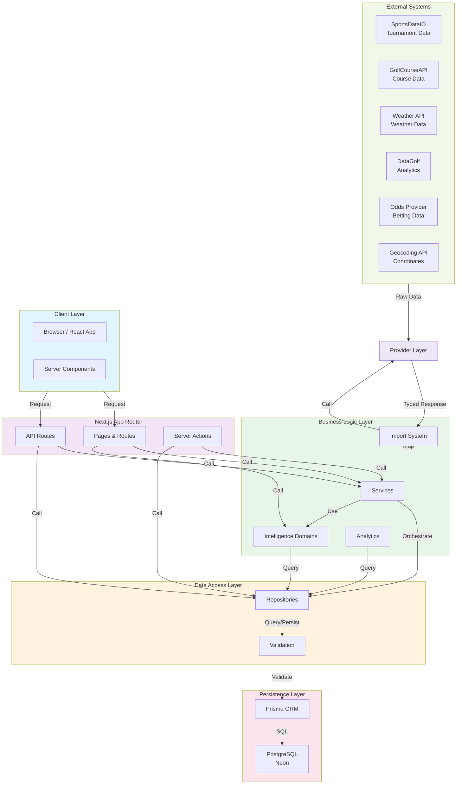
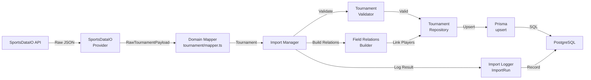
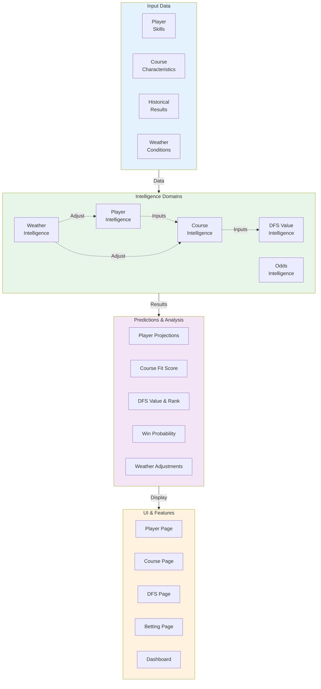
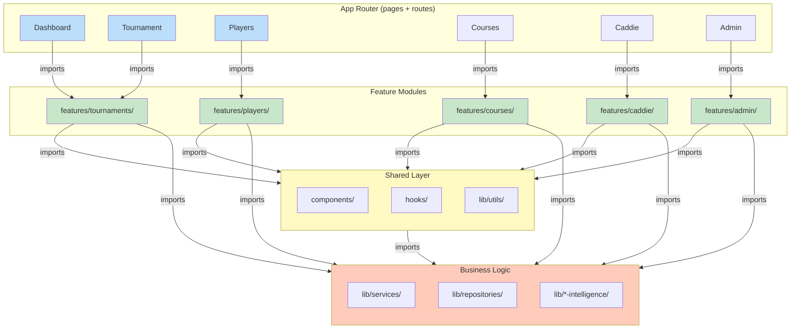
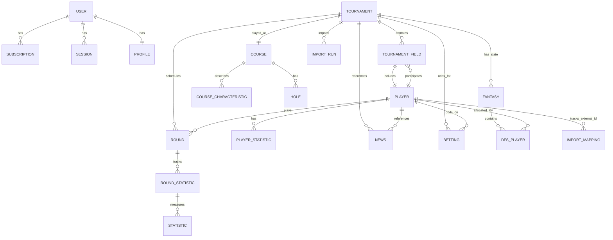
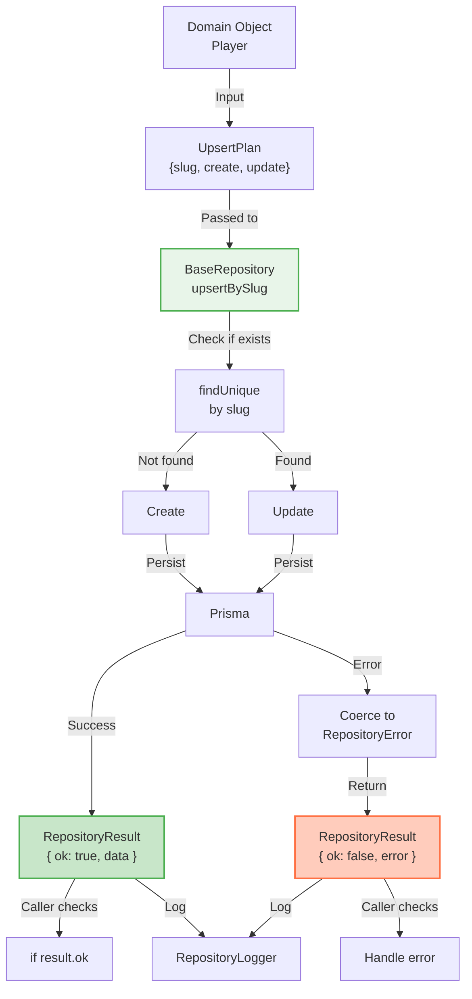
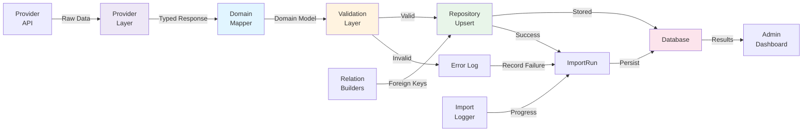

# CaddieIQ Architecture Diagram

**Documented:** July 20, 2026  
**Format:** Mermaid diagrams + ASCII art  
**Purpose:** Visual reference for platform architecture

---

## 1. High-Level System Architecture



---

## 2. Data Flow: Tournament Import



---

## 3. Service Orchestration Pattern

```mermaid
graph TB
    A["API Route<br/>POST /api/tournaments/:id/analyze"] -->|Request| B["Authentication<br/>Middleware"]
    B -->|Authorized User| C["Input Validation"]
    C -->|Valid Input| D["TournamentService"]
    
    D -->|Get| E["TournamentRepository"]
    D -->|Get| F["CourseRepository"]
    D -->|Analyze| G["CourseIntelligence"]
    D -->|Calculate| H["Analytics/<br/>StrokesGained"]
    D -->|Get Odds| I["BettingRepository"]
    
    E -->|Player[]| D
    F -->|Course| D
    G -->|Analysis| D
    H -->|SG Metrics| D
    I -->|Odds[]| D
    
    D -->|Combined Result| J["Response DTO"]
    J -->|JSON| K["Response"]
    
    style D fill:#e8f5e9,stroke:#4caf50,stroke-width:2px
```

---

## 4. Intelligence Domain Architecture



---

## 5. Feature Module Boundaries



---

## 6. Data Model Entity Relationship



---

## 7. API Route Organization

```
app/api/
├── auth/                    # Better Auth endpoints
│   └── [auth routes]
├── admin/                   # Admin-only operations
│   ├── tournaments/
│   ├── players/
│   ├── courses/
│   └── data-coverage/
├── caddie/                  # AI Caddie endpoints
│   └── analyze/
├── imports/                 # Data import operations
│   ├── tournaments
│   ├── players
│   ├── courses
│   └── [type]/
├── analytics/               # Analytics queries
│   ├── strokes-gained/
│   ├── rankings/
│   └── course-fit/
├── tournaments/             # Tournament queries
│   ├── [id]/
│   └── [id]/analyze
├── players/                 # Player queries
│   ├── [id]/
│   └── [id]/compare
├── courses/                 # Course queries
│   └── [id]/analyze
├── setup/                   # Initial setup
├── system-health/           # System monitoring
│   └── providers
└── audit/                   # Audit logs
```

---

## 8. Layer Dependencies Graph

```
┌─────────────────────────────────────────────────────────────────┐
│ PRESENTATION LAYER                                              │
│ ┌──────────────────────────────────────────────────────────┐   │
│ │ app/           Components       Pages       API Routes    │   │
│ │ - UI rendering - Event handling - Data fetching - Auth   │   │
│ └──────────────────────────────────────────────────────────┘   │
└────────────┬────────────────────────────────────────────────────┘
             │ imports
             ↓
┌─────────────────────────────────────────────────────────────────┐
│ FEATURE MODULES LAYER                                           │
│ ┌──────────────────────────────────────────────────────────┐   │
│ │ features/[feature]/                                      │   │
│ │ - Feature components - Feature hooks - Feature services  │   │
│ └──────────────────────────────────────────────────────────┘   │
└────────────┬────────────────────────────────────────────────────┘
             │ imports
             ↓
┌─────────────────────────────────────────────────────────────────┐
│ BUSINESS LOGIC LAYER                                            │
│ ┌──────────────────────────────────────────────────────────┐   │
│ │ Services (orchestration)                                 │   │
│ │ Intelligence Domains (analysis)                          │   │
│ │ Analytics (statistics)                                   │   │
│ │ Imports (data coordination)                              │   │
│ └──────────────────────────────────────────────────────────┘   │
└────────────┬────────────────────────────────────────────────────┘
             │ imports
             ↓
┌─────────────────────────────────────────────────────────────────┐
│ DATA ACCESS LAYER                                               │
│ ┌──────────────────────────────────────────────────────────┐   │
│ │ Repositories (database abstraction)                      │   │
│ │ Validation (data integrity)                              │   │
│ │ Domain Models (mappers)                                  │   │
│ └──────────────────────────────────────────────────────────┘   │
└────────────┬────────────────────────────────────────────────────┘
             │ imports
             ↓
┌─────────────────────────────────────────────────────────────────┐
│ PERSISTENCE LAYER                                               │
│ ┌──────────────────────────────────────────────────────────┐   │
│ │ Prisma (ORM)                                             │   │
│ │ PostgreSQL (Database)                                    │   │
│ └──────────────────────────────────────────────────────────┘   │
└─────────────────────────────────────────────────────────────────┘
             ↕ (bidirectional through providers)
┌─────────────────────────────────────────────────────────────────┐
│ EXTERNAL INTEGRATION LAYER                                      │
│ ┌──────────────────────────────────────────────────────────┐   │
│ │ Providers (isolated API adapters)                        │   │
│ │ External APIs (SportsDataIO, Weather, etc.)              │   │
│ └──────────────────────────────────────────────────────────┘   │
└─────────────────────────────────────────────────────────────────┘

Key Rule: Each layer can only import from layers below (✓)
          Never import from layers above or same-level features (✗)
```

---

## 9. Request Flow: Get Player with Analysis

```
GET /api/players/123

    │
    ├─ [Auth Middleware]
    │  └─ Verify user authenticated
    │
    ├─ [Input Validation]
    │  └─ Validate player ID format
    │
    ├─ [API Route Handler]
    │  └─ app/api/players/[id]/route.ts
    │
    ├─ [Call Service Layer]
    │  └─ playerService.getPlayerWithAnalysis(123)
    │
    ├─ [Service Orchestrates]
    │  ├─ playerRepository.findById(123)
    │  │  └─ Prisma query
    │  ├─ playerIntelligence.analyze(player)
    │  │  ├─ playerSkillIntelligence.calculateRatings(player)
    │  │  └─ playerStatistics.getTrend(player)
    │  └─ analytics.getRecentForm(player)
    │
    ├─ [Return Response]
    │  └─ {
    │      player: {...},
    │      analysis: {...},
    │      trend: {...}
    │     }
    │
    └─ [Client]
       └─ Display player detail with analysis
```

---

## 10. Repository Pattern



---

## 11. Import Pipeline



---

## 12. Intelligence Stack

```
User Request
    ↓
┌─────────────────────────────────────────────┐
│ Feature Component (e.g., PlayerDetail)      │
│ "Show player fit for this course"           │
└──────────────┬──────────────────────────────┘
               ↓
┌─────────────────────────────────────────────┐
│ Service Layer                               │
│ playerService.getPlayerWithCourseAnalysis() │
└──────────────┬──────────────────────────────┘
               ↓
         ┌─────┴─────┐
         ↓           ↓
    ┌────────────┐ ┌──────────────────┐
    │Repository  │ │Intelligence      │
    │getPlayer() │ │courseIntelligence│
    │            │ │.fitScore()       │
    └────────────┘ └──────────────────┘
         ↓              ↓
    ┌────────────────────────────────┐
    │ Input Data                     │
    │ - Player skills (from DB)      │
    │ - Course characteristics (DB)  │
    │ - Historical results (DB)      │
    │ - Weather (if available)       │
    └────────────────────────────────┘
         ↓
    ┌────────────────────────────────┐
    │ Calculation                    │
    │ 1. Score player strengths      │
    │ 2. Match to course needs       │
    │ 3. Apply weather adjustments   │
    │ 4. Generate explanation        │
    └────────────────────────────────┘
         ↓
    ┌────────────────────────────────┐
    │ Result                         │
    │ {                              │
    │   fitScore: 8.2,               │
    │   confidence: 0.85,            │
    │   explanation: "..."           │
    │ }                              │
    └────────────────────────────────┘
         ↓
    Display to User
```

---

## 13. Folder Hierarchy Tree

```
caddieiq/
├── app/                           # Next.js App Router
│   ├── (app)/                     # Protected routes
│   ├── (auth)/                    # Public auth routes
│   ├── api/                       # API endpoints
│   ├── actions/                   # Server actions
│   ├── admin/                     # Admin tools
│   └── setup/                     # Setup flow
│
├── components/                    # Shared UI components
│   ├── auth/
│   ├── cards/
│   ├── charts/
│   ├── layout/
│   ├── navigation/
│   ├── shared/
│   └── ui/                        # Shadcn components
│
├── features/                      # Feature modules
│   ├── admin/                     # Admin feature
│   ├── tournaments/               # Tournaments feature
│   ├── players/                   # Players feature
│   ├── courses/                   # Courses feature
│   ├── caddie/                    # AI caddie feature
│   ├── analytics/                 # Analytics feature
│   ├── rankings/                  # Rankings feature
│   └── [13 more features]
│
├── lib/                           # Business logic
│   ├── domain/                    # Domain models
│   │   ├── player/
│   │   ├── course/
│   │   ├── tournament/
│   │   └── [more domains]
│   ├── repositories/              # Data access
│   │   └── [36 repository files]
│   ├── services/                  # Orchestration
│   ├── providers/                 # External APIs
│   │   ├── sportsdataio/
│   │   ├── golfcourseapi/
│   │   ├── weather/
│   │   └── [more providers]
│   ├── imports/                   # Import system
│   ├── [5x]-intelligence/         # Intelligence domains
│   │   ├── player-intelligence/
│   │   ├── course-intelligence/
│   │   ├── dfs-value/
│   │   ├── odds-intelligence/
│   │   └── weather-intelligence/
│   ├── analytics/                 # Analytics utilities
│   ├── utils/                     # Shared utilities
│   ├── types/                     # Shared types
│   └── generated/
│       └── prisma/                # Prisma client (generated)
│
├── hooks/                         # Global React hooks
├── constants/                     # Global constants
├── prisma/                        # Database schema
│   ├── schema.prisma
│   └── migrations/
├── docs/                          # Architecture documentation
└── public/                        # Static assets
```

---

## Summary

The architecture follows a **strict layered model** with clear boundaries:

1. **Presentation** (Next.js/React) - User interface
2. **Features** - Domain-specific UI and hooks
3. **Business Logic** - Services, intelligence, analysis
4. **Data Access** - Repositories, validation
5. **Persistence** - Prisma, PostgreSQL
6. **External** - Providers, third-party APIs

Each layer depends only on layers below it. Data flows from presentation downward; responses flow upward. External integrations are isolated in the provider layer, making them easy to swap.

