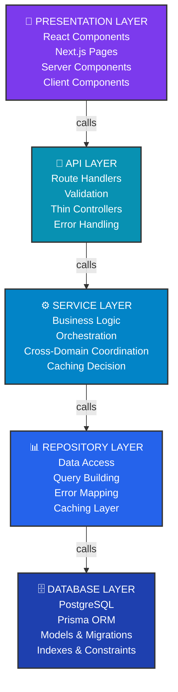
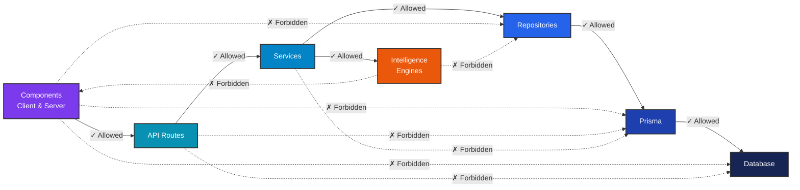
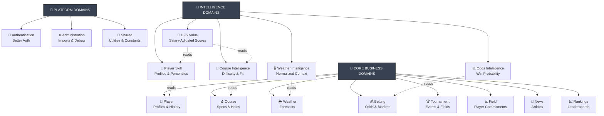
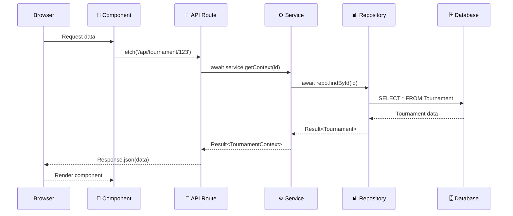
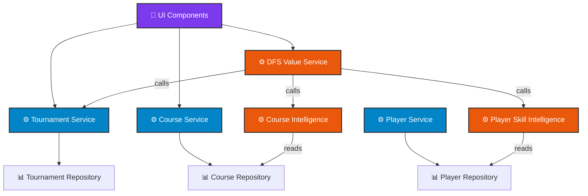
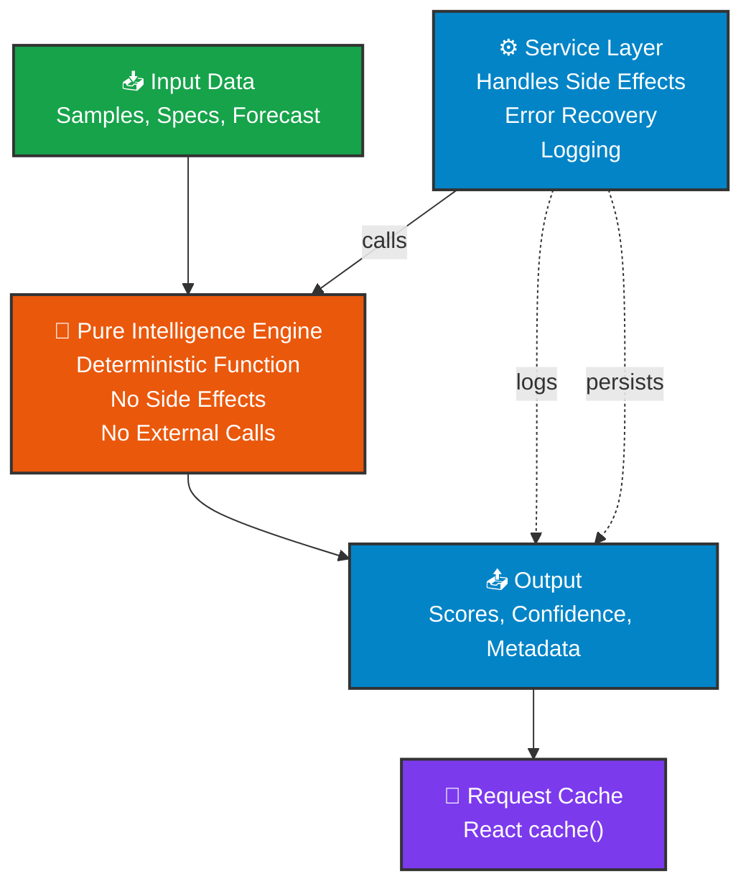
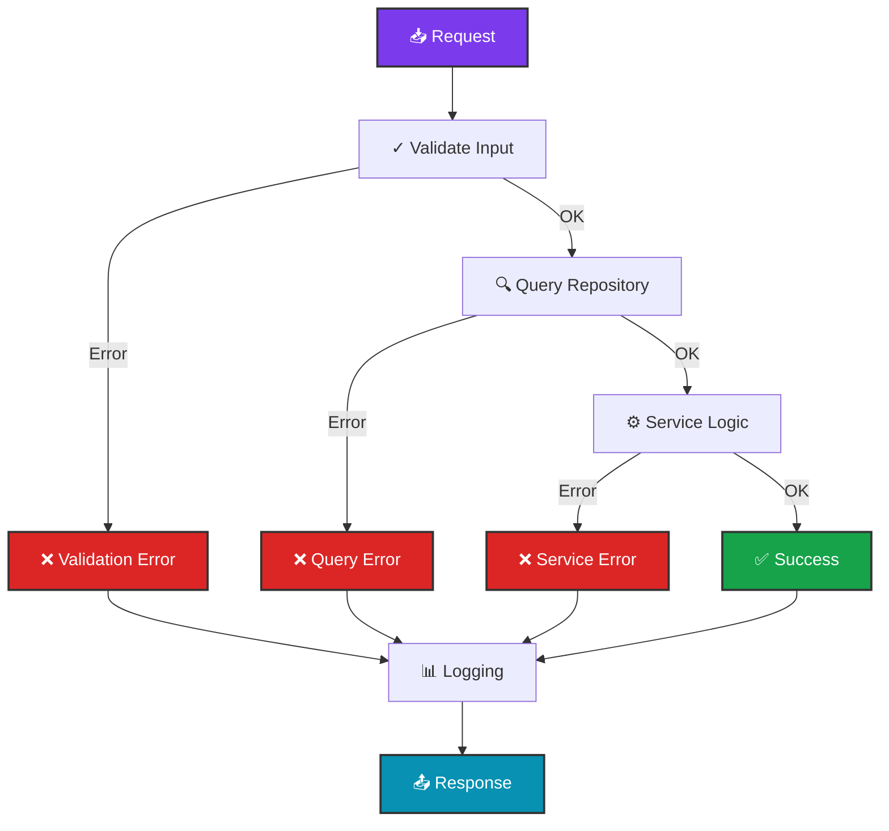
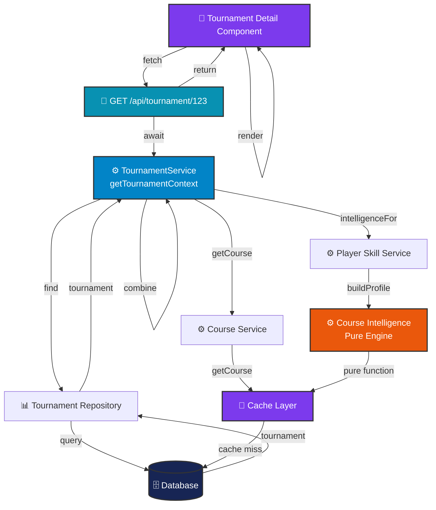

# CaddieIQ Architecture Diagrams

**Phase:** 15.3C — Platform Engineering Standards

---

## 1. Platform Layers



---

## 2. Dependency Hierarchy



---

## 3. Domain Ownership



---

## 4. Request Lifecycle



---

## 5. Service Coordination



---

## 6. Intelligence Engine Architecture



---

## 7. Error Handling Flow



---

## 8. Data Flow: Get Tournament with Intelligence



---

## Cross-Domain Call Patterns

### ✓ ALLOWED Patterns

```
Domain A Service
    ↓
Domain B Service (read-only data)
```

```
Domain A Intelligence Engine
    ↓
Domain A Repository (read-only)
```

```
Component
    ↓
API Route
    ↓
Domain Service
```

### ✗ FORBIDDEN Patterns

```
Component → Prisma (Direct)
Component → Repository
Service → Prisma (Direct)
Repository → Repository (different domain)
Intelligence → Component
Component → Service (Direct)
```

---

## Mermaid Diagram Usage

Copy any diagram above to view in:
- GitHub markdown
- Mermaid Live Editor: https://mermaid.live
- VS Code with Mermaid extension
- Notion, Confluence, etc.

All diagrams render automatically on GitHub markdown files.
