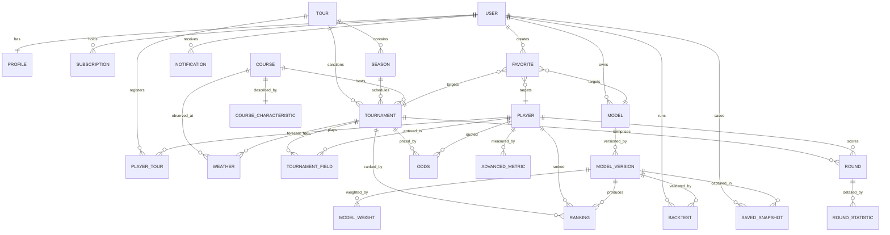

# Entity Relationship Diagram — CaddieIQ

> **Status: Design blueprint only.** This document defines the complete data
> architecture for CaddieIQ. It contains **no SQL, no Prisma schema, and no
> migrations**. It is the authoritative reference from which the Prisma schema
> will be generated in a later sprint. Target platform: **PostgreSQL (Neon)**.
>
> This document supersedes and expands the high-level sketch in
> [DATABASE.md](./DATABASE.md). Where the two differ, ERD.md is canonical.

---

## Table of Contents

1. [Naming Conventions](#1-naming-conventions)
2. [Domain Overview](#2-domain-overview)
3. [High-Level ER Diagram](#3-high-level-er-diagram)
4. [Entity Reference](#4-entity-reference)
   - [Identity & Billing](#identity--billing)
   - [Tour Structure](#tour-structure)
   - [Competition & Results](#competition--results)
   - [Metrics & Market Data](#metrics--market-data)
   - [Modeling & Analytics](#modeling--analytics)
   - [Engagement](#engagement)
5. [Relationship Catalog](#5-relationship-catalog)
6. [Performance Strategy](#6-performance-strategy)
7. [Future Expansion](#7-future-expansion)

---

## 1. Naming Conventions

These rules apply to every entity in this document and must be honored when the
Prisma schema is generated.

### Tables

- **`snake_case`**, **plural** nouns: `users`, `model_versions`, `round_statistics`.
- Join/junction tables are named for both sides in alphabetical order:
  `favorite_models`, `model_version_weights`.
- No environment or tenant prefixes; a single logical database serves the platform.

### Columns

- **`snake_case`** throughout: `world_ranking`, `current_period_end`.
- Booleans read as predicates: `is_active`, `has_cut`, `is_public`.
- Timestamps end in `_at`: `created_at`, `updated_at`, `deleted_at`, `captured_at`.
- Dates (no time) end in `_date`: `start_date`, `range_end_date`.
- Monetary and metric precision columns use exact numerics, never floats.

### Primary Keys

- Every table has a surrogate primary key named **`id`** of type **UUID** (v7
  preferred for time-sortability).
- No composite primary keys; uniqueness of natural keys is enforced with
  **unique constraints** instead (see each entity).

### Foreign Keys

- Named `<referenced_singular>_id`: `tour_id`, `model_version_id`, `user_id`.
- Every foreign key is **indexed**.
- Delete behavior is declared per relationship — `CASCADE` for owned children,
  `RESTRICT` for reference data, `SET NULL` for optional links.

### Enums

- Represented as PostgreSQL enums (or Prisma `enum`), named **singular**:
  `user_role`, `subscription_tier`, `tournament_status`, `model_status`.
- Enum values are lowercase `snake_case`: `past_due`, `in_progress`.

### Indexes

- Named `idx_<table>_<columns>`: `idx_rounds_tournament_id_player_id`.
- Unique indexes named `uq_<table>_<columns>`: `uq_users_email`.
- Composite indexes are ordered by selectivity (most selective column first)
  except where a query's sort/range column must trail.

### Common Columns

Unless stated otherwise, **every** table carries:

| Column | Type | Purpose |
| --- | --- | --- |
| `id` | uuid | Surrogate primary key. |
| `created_at` | timestamptz | Row creation, defaulted server-side. |
| `updated_at` | timestamptz | Last mutation, maintained on update. |

Tables that support soft deletion additionally carry `deleted_at timestamptz null`.

---

## 2. Domain Overview

CaddieIQ data falls into six cohesive groups:

| Group | Entities | Ownership |
| --- | --- | --- |
| **Identity & Billing** | Users, Profiles, Subscriptions | Per-user (private) |
| **Tour Structure** | Tours, Seasons, Courses, Course Characteristics | Shared reference data |
| **Competition & Results** | Tournaments, Tournament Fields, Players, Rounds, Round Statistics | Shared reference data |
| **Metrics & Market Data** | Advanced Metrics, Rankings, Odds, Weather | Shared reference data |
| **Modeling & Analytics** | Models, Model Versions, Model Weights, Saved Snapshots, Backtests | Per-user (private) |
| **Engagement** | Favorites, Notifications | Per-user (private) |

Reference data (tours, courses, players, results, odds, weather) is ingested by
the platform and read by all users. Modeling and engagement data is owned by
individual users and must be scoped by `user_id` in every query.

---

## 3. High-Level ER Diagram

> The many-to-many between players and tours is resolved through the
> `PLAYER_TOUR` junction. Favorites are polymorphic (see the Favorites entity).

---

## 4. Entity Reference

Each entity below documents: **Purpose**, **Primary Key**, **Foreign Keys**,
**Relationships**, **Indexes**, **Unique Constraints**, and **Notes**.

---

### Identity & Billing

#### Users

- **Purpose:** Authentication root and workspace owner. Every private row in the
  system traces back to a user.
- **Primary Key:** `id` (uuid).
- **Foreign Keys:** none.
- **Relationships:**
  - One-to-one → `profiles`.
  - One-to-many → `subscriptions`, `models`, `backtests`, `saved_snapshots`,
    `favorites`, `notifications`.
- **Indexes:** `idx_users_created_at`.
- **Unique Constraints:** `uq_users_email`.
- **Notes:** `email` is the login identifier. `role` is a `user_role` enum
  (`user`, `admin`). Password hashing / session handling is delegated to the auth
  layer (Better Auth or provider); this table stores only the canonical account
  record. Supports soft delete via `deleted_at`.

#### Profiles

- **Purpose:** Extended, mutable account details separated from the authentication
  record so profile edits never touch the identity row.
- **Primary Key:** `id` (uuid).
- **Foreign Keys:** `user_id` → `users.id` (CASCADE).
- **Relationships:** One-to-one with `users`.
- **Indexes:** implicit on the unique `user_id`.
- **Unique Constraints:** `uq_profiles_user_id` (enforces 1:1).
- **Notes:** Holds `display_name`, `workspace_name`, `avatar_url`, `timezone`,
  `default_tour_id` (nullable FK → `tours`, `SET NULL`), and a `preferences`
  jsonb blob for UI settings. Kept deliberately thin and denormalized-free.

#### Subscriptions

- **Purpose:** Billing state and entitlement tier that gates premium features
  (AI insights, unlimited models, advanced backtesting).
- **Primary Key:** `id` (uuid).
- **Foreign Keys:** `user_id` → `users.id` (CASCADE).
- **Relationships:** Many-to-one → `users` (a user may have historical rows; at
  most one active).
- **Indexes:** `idx_subscriptions_user_id`, `idx_subscriptions_status`.
- **Unique Constraints:** `uq_subscriptions_provider_subscription_id`;
  partial unique on `(user_id)` where `status = 'active'` to guarantee a single
  active subscription per user.
- **Notes:** `tier` is `subscription_tier` (`free`, `pro`, `premium`); `status`
  is `subscription_status` (`active`, `trialing`, `past_due`, `canceled`,
  `incomplete`). Stores `provider_customer_id`, `provider_subscription_id`,
  `current_period_end`, `cancel_at`. Billing provider is Stripe.

---

### Tour Structure

#### Tours

- **Purpose:** Top-level competitive organization (PGA Tour, DP World Tour, LIV,
  Korn Ferry, LPGA). The anchor for multi-tour support.
- **Primary Key:** `id` (uuid).
- **Foreign Keys:** none.
- **Relationships:** One-to-many → `seasons`, `tournaments`. Many-to-many →
  `players` via `player_tours`.
- **Indexes:** `idx_tours_region`.
- **Unique Constraints:** `uq_tours_code`.
- **Notes:** `code` is a stable short identifier (`pga`, `dpw`, `liv`, `kft`,
  `lpga`). `is_active` flags currently-supported tours so new tours can be staged
  before launch.

#### Seasons

- **Purpose:** A dated competitive cycle within a tour (e.g. PGA Tour 2025).
  Enables historical season slicing and season-over-season comparison.
- **Primary Key:** `id` (uuid).
- **Foreign Keys:** `tour_id` → `tours.id` (CASCADE).
- **Relationships:** Many-to-one → `tours`; one-to-many → `tournaments`.
- **Indexes:** `idx_seasons_tour_id`, `idx_seasons_start_date`.
- **Unique Constraints:** `uq_seasons_tour_id_year`.
- **Notes:** Carries `year`, `start_date`, `end_date`, `is_current`. A tournament
  always resolves both its tour (directly) and season (directly) so historical
  queries never depend on date math.

#### Courses

- **Purpose:** Physical venue master record, reusable across tournaments and
  seasons.
- **Primary Key:** `id` (uuid).
- **Foreign Keys:** none.
- **Relationships:** One-to-one → `course_characteristics`; one-to-many →
  `tournaments`, `weather`.
- **Indexes:** `idx_courses_country`.
- **Unique Constraints:** `uq_courses_name_location`.
- **Notes:** Stores identity/location (`name`, `city`, `region`, `country`,
  `latitude`, `longitude`) and baseline `par` / `yardage`. Detailed playing
  attributes live in `course_characteristics` to keep this record stable.

#### Course Characteristics

- **Purpose:** Descriptive, model-relevant profile of a course used for
  course-fit analysis (grass type, difficulty, elevation, layout tendencies).
- **Primary Key:** `id` (uuid).
- **Foreign Keys:** `course_id` → `courses.id` (CASCADE).
- **Relationships:** One-to-one with `courses`.
- **Unique Constraints:** `uq_course_characteristics_course_id`.
- **Notes:** Columns include `grass_type_greens`, `grass_type_fairway`,
  `elevation_ft`, `difficulty_rating`, `avg_driving_distance_required`,
  `rough_length`, plus an `attributes` jsonb for extensible/experimental factors.
  Separated from `courses` so profile refinements are isolated and versionable.

---

### Competition & Results

#### Tournaments

- **Purpose:** A single event hosted by a course, within a tour and season. The
  central hub linking fields, rounds, rankings, odds, and weather.
- **Primary Key:** `id` (uuid).
- **Foreign Keys:** `tour_id` → `tours.id` (RESTRICT); `season_id` →
  `seasons.id` (RESTRICT); `course_id` → `courses.id` (RESTRICT).
- **Relationships:** Many-to-one → tour, season, course. One-to-many →
  `tournament_fields`, `rounds`, `rankings`, `odds`, `weather`.
- **Indexes:** `idx_tournaments_tour_id`, `idx_tournaments_season_id`,
  `idx_tournaments_course_id`, `idx_tournaments_start_date`,
  `idx_tournaments_status`.
- **Unique Constraints:** `uq_tournaments_tour_id_season_id_slug`.
- **Notes:** `status` is `tournament_status` (`scheduled`, `in_progress`,
  `completed`, `canceled`). Carries `start_date`, `end_date`, `purse`,
  `is_major`, `has_cut`, `cut_line`. RESTRICT deletes protect reference integrity.

#### Tournament Fields

- **Purpose:** Junction resolving the many-to-many between tournaments and
  players — i.e. the entry list for an event, plus per-entry status.
- **Primary Key:** `id` (uuid).
- **Foreign Keys:** `tournament_id` → `tournaments.id` (CASCADE);
  `player_id` → `players.id` (CASCADE).
- **Relationships:** Many-to-one → tournament and player (resolves M:N).
- **Indexes:** `idx_tournament_fields_tournament_id`,
  `idx_tournament_fields_player_id`.
- **Unique Constraints:** `uq_tournament_fields_tournament_id_player_id`.
- **Notes:** Stores `entry_status` (`committed`, `withdrawn`, `alternate`,
  `made_cut`, `missed_cut`), `tee_time_first_round`, `starting_hole`,
  `finish_position`, `total_to_par`. This is the definitive "who played" record.

#### Players

- **Purpose:** The global player universe, independent of any single tour so a
  player can compete across multiple tours over time.
- **Primary Key:** `id` (uuid).
- **Foreign Keys:** none (tour affiliation via `player_tours`).
- **Relationships:** Many-to-many → `tours` via `player_tours`. One-to-many →
  `tournament_fields`, `rounds`, `advanced_metrics`, `rankings`, `odds`.
- **Indexes:** `idx_players_country`, `idx_players_last_name`.
- **Unique Constraints:** `uq_players_external_ref` (external data-provider id).
- **Notes:** Holds `first_name`, `last_name`, `full_name`, `country`,
  `birth_date`, `turned_pro`, `is_active`. `world_ranking` is a convenience
  cache; authoritative rankings live in the `rankings`/metrics pipeline.

#### Player Tours (junction)

- **Purpose:** Resolves the many-to-many between players and tours, recording
  membership and status per tour/season.
- **Primary Key:** `id` (uuid).
- **Foreign Keys:** `player_id` → `players.id` (CASCADE); `tour_id` →
  `tours.id` (CASCADE); `season_id` → `seasons.id` (SET NULL, optional).
- **Relationships:** Many-to-one to each referenced entity.
- **Unique Constraints:** `uq_player_tours_player_id_tour_id_season_id`.
- **Notes:** `membership_status` (`full`, `conditional`, `special_temporary`,
  `past`). Enables "which players are on LIV in 2025" style queries.

#### Rounds

- **Purpose:** One player's score for one round of one tournament — the atomic
  scoring unit and the base for all performance metrics.
- **Primary Key:** `id` (uuid).
- **Foreign Keys:** `tournament_id` → `tournaments.id` (CASCADE);
  `player_id` → `players.id` (CASCADE).
- **Relationships:** Many-to-one → tournament and player; one-to-many →
  `round_statistics`.
- **Indexes:** `idx_rounds_tournament_id`, `idx_rounds_player_id`,
  `idx_rounds_tournament_id_player_id_round_number`.
- **Unique Constraints:** `uq_rounds_tournament_id_player_id_round_number`.
- **Notes:** `round_number` (1–4 plus playoff sentinel), `strokes`, `to_par`,
  `tee_time`, `status` (`scheduled`, `in_progress`, `complete`, `wd`, `dq`).
  High-volume table — candidate for partitioning by season (see §6).

#### Round Statistics

- **Purpose:** Granular per-round shot data (fairways hit, GIR, putts, scrambling,
  hole-by-hole). Kept separate from `rounds` to isolate wide, sparse detail.
- **Primary Key:** `id` (uuid).
- **Foreign Keys:** `round_id` → `rounds.id` (CASCADE).
- **Relationships:** Many-to-one → `rounds`.
- **Indexes:** `idx_round_statistics_round_id`,
  `idx_round_statistics_round_id_stat_key`.
- **Unique Constraints:** `uq_round_statistics_round_id_stat_key`.
- **Notes:** Modeled as a tall key/value table (`stat_key`, `stat_value` numeric,
  `unit`) so new tracked stats never require a migration. Optional `hole_data`
  jsonb captures hole-by-hole arrays. `stat_key` values are governed by a
  documented vocabulary shared with `advanced_metrics`.

---

### Metrics & Market Data

#### Advanced Metrics

- **Purpose:** Derived, model-facing performance measures aggregated over a
  window — strokes-gained categories, course-fit scores, form ratings.
- **Primary Key:** `id` (uuid).
- **Foreign Keys:** `player_id` → `players.id` (CASCADE);
  `tournament_id` → `tournaments.id` (SET NULL, optional);
  `season_id` → `seasons.id` (SET NULL, optional).
- **Relationships:** Many-to-one → player, and optionally tournament/season for
  scoping.
- **Indexes:** `idx_advanced_metrics_player_id`,
  `idx_advanced_metrics_metric_key`, `idx_advanced_metrics_player_id_period_end`.
- **Unique Constraints:**
  `uq_advanced_metrics_player_id_metric_key_period_start_period_end`.
- **Notes:** `metric_key` (e.g. `sg_total`, `sg_approach`, `driving_accuracy`),
  `metric_value` numeric, `period_start` / `period_end`, `sample_size`,
  `context` jsonb. Designed for time-windowed queries feeding the model engine.

#### Rankings

- **Purpose:** An ordered projection of a tournament field. Serves two sources:
  official/world rankings and **model-generated** rankings.
- **Primary Key:** `id` (uuid).
- **Foreign Keys:** `tournament_id` → `tournaments.id` (CASCADE);
  `player_id` → `players.id` (CASCADE);
  `model_version_id` → `model_versions.id` (CASCADE, nullable).
- **Relationships:** Many-to-one → tournament, player, and optionally a model
  version (null for official/world rankings).
- **Indexes:** `idx_rankings_tournament_id`,
  `idx_rankings_model_version_id_tournament_id`, `idx_rankings_player_id`.
- **Unique Constraints:**
  `uq_rankings_tournament_id_player_id_model_version_id_ranking_type`.
- **Notes:** `ranking_type` (`world`, `tour`, `model`, `projected`), `rank`,
  `score` numeric, `generated_at`. A null `model_version_id` denotes
  externally-sourced rankings; a non-null value denotes CaddieIQ model output.

#### Odds

- **Purpose:** Sportsbook lines captured over time for comparison against model
  projections (edge detection).
- **Primary Key:** `id` (uuid).
- **Foreign Keys:** `tournament_id` → `tournaments.id` (CASCADE);
  `player_id` → `players.id` (CASCADE).
- **Relationships:** Many-to-one → tournament and player.
- **Indexes:** `idx_odds_tournament_id`, `idx_odds_player_id`,
  `idx_odds_tournament_id_market_captured_at`.
- **Unique Constraints:**
  `uq_odds_tournament_id_player_id_market_sportsbook_captured_at`.
- **Notes:** `market` (`outright`, `top_5`, `top_10`, `top_20`, `make_cut`,
  `matchup`), `sportsbook`, `price_decimal`, `price_american`,
  `implied_probability`, `captured_at`. Append-only time series — never updated
  in place, enabling line-movement history.

#### Weather

- **Purpose:** Observed and forecast course conditions, a first-class model input.
- **Primary Key:** `id` (uuid).
- **Foreign Keys:** `course_id` → `courses.id` (CASCADE);
  `tournament_id` → `tournaments.id` (SET NULL, optional).
- **Relationships:** Many-to-one → course, and optionally tournament.
- **Indexes:** `idx_weather_course_id`, `idx_weather_tournament_id`,
  `idx_weather_course_id_observed_at`.
- **Unique Constraints:**
  `uq_weather_course_id_observed_at_reading_type`.
- **Notes:** `reading_type` (`observed`, `forecast`), `observed_at`,
  `wind_speed`, `wind_direction`, `gust_speed`, `temperature`, `precipitation`,
  `humidity`, `conditions` jsonb. Append-only time series; forecasts and
  observations coexist distinguished by `reading_type`.

---

### Modeling & Analytics

#### Models

- **Purpose:** A user's named predictive model concept — the stable container
  whose logic evolves through versions.
- **Primary Key:** `id` (uuid).
- **Foreign Keys:** `user_id` → `users.id` (CASCADE).
- **Relationships:** Many-to-one → user; one-to-many → `model_versions`,
  `favorites`. Referenced by `saved_snapshots` and `backtests` through versions.
- **Indexes:** `idx_models_user_id`, `idx_models_status`.
- **Unique Constraints:** `uq_models_user_id_slug`.
- **Notes:** `name`, `description`, `status` (`model_status`: `draft`, `active`,
  `archived`), `is_public` (marketplace readiness), `current_version_id`
  (nullable FK → `model_versions`, SET NULL) pointing at the active version.
  Owns no weights directly — those belong to versions.

#### Model Versions

- **Purpose:** An immutable snapshot of a model's configuration. Editing a model
  produces a new version, giving full history and reproducibility.
- **Primary Key:** `id` (uuid).
- **Foreign Keys:** `model_id` → `models.id` (CASCADE).
- **Relationships:** Many-to-one → model; one-to-many → `model_weights`,
  `rankings`, `backtests`, `saved_snapshots`.
- **Indexes:** `idx_model_versions_model_id`.
- **Unique Constraints:** `uq_model_versions_model_id_version_number`.
- **Notes:** `version_number` (monotonic per model), `scoring_logic` jsonb
  (how weighted inputs combine), `change_note`, `is_published`. Immutable once
  created — new configuration means a new row. This is the unit that produces
  rankings and is validated by backtests.

#### Model Weights

- **Purpose:** The individual weighted inputs that make up a model version's
  scoring formula.
- **Primary Key:** `id` (uuid).
- **Foreign Keys:** `model_version_id` → `model_versions.id` (CASCADE).
- **Relationships:** Many-to-one → model version.
- **Indexes:** `idx_model_weights_model_version_id`.
- **Unique Constraints:** `uq_model_weights_model_version_id_input_key`.
- **Notes:** `input_key` (references the shared metric vocabulary, e.g.
  `sg_approach`), `weight` numeric, `direction` (`positive`, `negative`),
  `is_enabled`, `transform` (`raw`, `zscore`, `percentile`). Belongs to a
  version, never directly to a model, preserving historical formulas.

#### Saved Snapshots

- **Purpose:** A frozen capture of a model version's output (a ranking run and
  its inputs) at a moment in time, for later review or sharing.
- **Primary Key:** `id` (uuid).
- **Foreign Keys:** `user_id` → `users.id` (CASCADE);
  `model_version_id` → `model_versions.id` (CASCADE);
  `tournament_id` → `tournaments.id` (SET NULL, optional).
- **Relationships:** Many-to-one → user, model version, and optionally tournament.
- **Indexes:** `idx_saved_snapshots_user_id`,
  `idx_saved_snapshots_model_version_id`.
- **Unique Constraints:** none (a user may snapshot the same run repeatedly).
- **Notes:** `label`, `captured_at`, `payload` jsonb (the materialized rankings
  and metric inputs at capture time). Snapshots are self-contained so they remain
  meaningful even if underlying reference data is later corrected.

#### Backtests

- **Purpose:** Historical validation of a model version across a date range,
  measuring how the model would have performed.
- **Primary Key:** `id` (uuid).
- **Foreign Keys:** `user_id` → `users.id` (CASCADE);
  `model_version_id` → `model_versions.id` (CASCADE).
- **Relationships:** Many-to-one → user and model version.
- **Indexes:** `idx_backtests_user_id`, `idx_backtests_model_version_id`,
  `idx_backtests_status`.
- **Unique Constraints:** none.
- **Notes:** `range_start_date`, `range_end_date`, `status` (`backtest_status`:
  `queued`, `running`, `complete`, `failed`), `accuracy`, `roi`, `hit_rate`
  (numerics), `results` jsonb (per-event breakdown), `error_message`. Long-running
  jobs; status transitions are driven by a background worker.

---

### Engagement

#### Favorites

- **Purpose:** A user's bookmarks across heterogeneous targets — models, players,
  tournaments, or courses.
- **Primary Key:** `id` (uuid).
- **Foreign Keys:** `user_id` → `users.id` (CASCADE). Target reference is
  **polymorphic** (see notes).
- **Relationships:** Many-to-one → user; polymorphic many-to-one → target entity.
- **Indexes:** `idx_favorites_user_id`,
  `idx_favorites_user_id_target_type_target_id`.
- **Unique Constraints:**
  `uq_favorites_user_id_target_type_target_id`.
- **Notes:** Implemented with `target_type` (`favorite_target`: `model`,
  `player`, `tournament`, `course`) + `target_id` (uuid). Because Postgres cannot
  enforce a single FK across multiple tables, the Prisma layer validates the
  target; alternatively this can be normalized into per-type join tables
  (`favorite_models`, `favorite_players`) at schema-generation time — the polymorphic
  form is documented here as the intended logical model.

#### Notifications

- **Purpose:** In-app messages to a user — backtest completion, model run ready,
  odds movement alerts, subscription events.
- **Primary Key:** `id` (uuid).
- **Foreign Keys:** `user_id` → `users.id` (CASCADE).
- **Relationships:** Many-to-one → user.
- **Indexes:** `idx_notifications_user_id`,
  `idx_notifications_user_id_read_at`, `idx_notifications_created_at`.
- **Unique Constraints:** none.
- **Notes:** `type` (`notification_type`: `backtest_complete`, `model_ready`,
  `odds_alert`, `system`, `billing`), `title`, `body`, `data` jsonb (deep-link
  context), `read_at` (nullable — null means unread). Partial index on unread
  rows keeps the badge count query cheap.

---

## 5. Relationship Catalog

### One-to-One

| Relationship | Enforcement |
| --- | --- |
| Users ↔ Profiles | Unique `profiles.user_id`. |
| Courses ↔ Course Characteristics | Unique `course_characteristics.course_id`. |

### One-to-Many

| Parent | Children |
| --- | --- |
| Users | Subscriptions, Models, Backtests, Saved Snapshots, Favorites, Notifications |
| Tours | Seasons, Tournaments |
| Seasons | Tournaments |
| Courses | Tournaments, Weather |
| Tournaments | Tournament Fields, Rounds, Rankings, Odds, Weather |
| Players | Tournament Fields, Rounds, Advanced Metrics, Rankings, Odds |
| Rounds | Round Statistics |
| Models | Model Versions |
| Model Versions | Model Weights, Rankings, Backtests, Saved Snapshots |

### Many-to-Many (resolved via junction)

| Sides | Junction | Payload |
| --- | --- | --- |
| Players ↔ Tours | `player_tours` | membership status, season |
| Players ↔ Tournaments | `tournament_fields` | entry status, tee time, finish |

### Polymorphic

| Relationship | Mechanism |
| --- | --- |
| Favorites → {Model, Player, Tournament, Course} | `target_type` + `target_id` |

### Optional / Nullable Links

- `rankings.model_version_id` — null for official/world rankings, set for model
  output.
- `weather.tournament_id`, `advanced_metrics.tournament_id/season_id`,
  `saved_snapshots.tournament_id` — optional scoping, `SET NULL` on delete.

---

## 6. Performance Strategy

### Indexing

- **Every foreign key is indexed** to keep joins and cascade checks fast.
- **Composite indexes** back the hottest access paths:
  - `rankings (model_version_id, tournament_id)` — fetch a model's run for an event.
  - `rounds (tournament_id, player_id, round_number)` — leaderboard assembly.
  - `odds (tournament_id, market, captured_at)` — latest line + movement.
  - `advanced_metrics (player_id, period_end)` — most-recent window lookups.
- **Partial indexes** for skewed predicates: unread notifications
  (`WHERE read_at IS NULL`) and the single active subscription per user.

### Query Optimization

- Reference data is read-mostly; lean on covering/composite indexes and
  application-level caching rather than denormalization.
- Keep wide/sparse detail (`round_statistics`, jsonb blobs) out of the hot
  leaderboard and ranking paths so those scans stay narrow.
- Use the tall key/value shape for stats/metrics so new measures never force a
  schema change or index bloat.

### Historical Data

- `rounds`, `round_statistics`, `odds`, `weather`, and `advanced_metrics` are the
  large, ever-growing time-series tables. `season_id` / timestamp columns make
  historical slicing efficient.
- Odds and weather are **append-only** — treat them as immutable event logs to
  preserve line-movement and forecast history.

### Partitioning Strategy

- **Range-partition by season/year** for `rounds`, `round_statistics`, `odds`,
  and `weather` once volume warrants it. Season boundaries are natural, aligned
  with how users query (single event or single season at a time).
- Older seasons can be moved to cheaper storage or detached while remaining
  attachable for backtests over long ranges.
- Partitioning is deferred until data volume justifies the operational cost; the
  schema (season/timestamp columns present everywhere) is designed to adopt it
  without structural change.

### Caching Considerations

- Cache derived, expensive reads: current leaderboards, latest model rankings,
  and "most recent odds per player/market."
- Redis (Upstash) is the intended cache/ephemeral layer for hot projections,
  rate limiting, and background-job coordination (backtests) — never as the
  system of record.
- Consider **materialized views** for heavy aggregate analytics (season-long
  strokes-gained leaderboards) refreshed on ingest.

---

## 7. Future Expansion

The architecture is explicitly built to absorb the following without breaking
changes:

| Requirement | How the design supports it |
| --- | --- |
| **PGA / DP World / LIV / Korn Ferry / LPGA** | `tours` is a first-class entity; nothing is hard-coded to a single tour. New tours are rows. |
| **Multiple tours simultaneously** | All competition data hangs off `tour_id` + `season_id`; players relate to tours many-to-many via `player_tours`. |
| **Historical seasons** | `seasons` + season/timestamp columns on all result tables enable unbounded history and cross-season comparison. |
| **User-generated models** | `models` owned by `users`, isolated per user, marketplace-ready via `is_public`. |
| **Model versioning** | `model_versions` are immutable; `model_weights` hang off versions, giving full reproducibility. |
| **Backtesting** | `backtests` reference a specific `model_version` over a date range and read from partition-friendly historical tables. |
| **Weather** | First-class `weather` time series linked to courses and events, ready as a model input. |
| **Sportsbook odds** | Append-only `odds` time series across markets and books enables edge detection and line-movement analysis. |
| **AI-generated insights** | Snapshots and jsonb payloads provide stable inputs; insights can be stored as `notifications` or a future `insights` table without touching core schema. |
| **Future simulation engine** | Immutable model versions + snapshotted inputs + partitioned history give deterministic, reproducible simulation runs. Simulation outputs slot in as a new `ranking_type` or a dedicated `simulations` table. |

### Reserved Extension Points

- **`insights`** (future): AI-generated narrative tied to a `model_version_id`
  and/or `tournament_id`.
- **`simulations`** (future): Monte Carlo run headers with results in a
  partitioned child table, mirroring the backtest pattern.
- **`data_ingestion_runs`** (future): provenance/audit for reference-data loads,
  supporting correction and reproducibility.

These are intentionally **not** modeled yet — they are noted so the current
design leaves room for them without rework.
