# Course-Player Matching Engine — Technical Diagrams

**Status:** Phase 16A Architecture  
**Date:** 2026-07-20  

---

## 1. Data Flow Diagram

```mermaid
graph TD
    A["PGA Tour Statistics"] -->|Daily| B["Player Attribute\nAggregation"]
    C["ShotLink\nBall Tracking"] -->|Daily| B
    D["Player News &\nStatus"] -->|Real-time| B
    
    E["Course Design\nDatabase"] -->|Per event| F["Course Profile\nBuilder"]
    G["Tournament Setup\nSheets"] -->|Tournament week| F
    H["Historical Scoring\nData"] -->|Per tournament| F
    I["Weather Data"] -->|Daily| F
    
    B -->|Player Skill\nProfile| J["Matching Engine\nCore"]
    F -->|Course Demand\nProfile| J
    
    J -->|Version Build\nV{n}| K["Match Score\nRepository"]
    
    K -->|Field Rankings| L["Tournament\nRankings Page"]
    K -->|Player Fit| M["Player Card\nDetail"]
    K -->|Comparative| N["AI Caddie\nExplanations"]
    K -->|Fit+Salary| O["DFS Value\nIntegration"]
    K -->|Fit+Odds| P["Betting\nRecommendations"]
    
    L --> Q["Public API"]
    M --> Q
    N --> Q
    O --> Q
    P --> Q
    
    Q -->|REST/GraphQL| R["CaddieIQ\nUI Components"]
    Q -->|Data Feed| S["Mobile Apps"]
    Q -->|Integration| T["DFS Platforms"]
    Q -->|Integration| U["Betting Apps"]
```

---

## 2. Match Score Calculation Flow

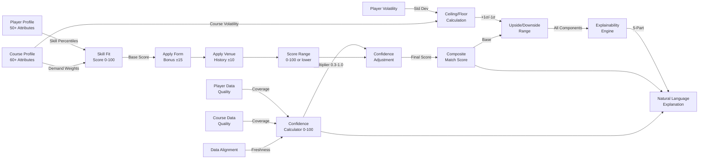

---

## 3. Confidence Calculation Hierarchy

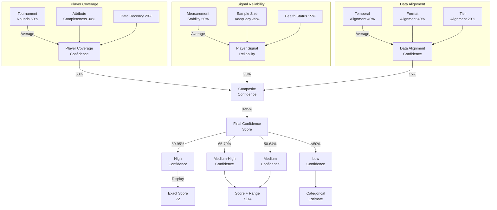

---

## 4. Versioning & Build Lifecycle

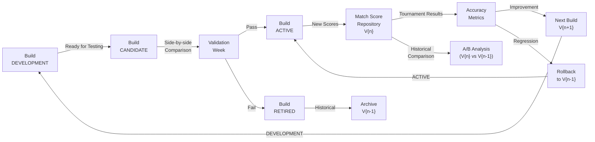

---

## 5. Player Skill Fit Scoring

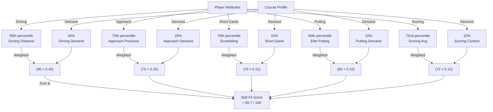

---

## 6. Complete Match Score Components

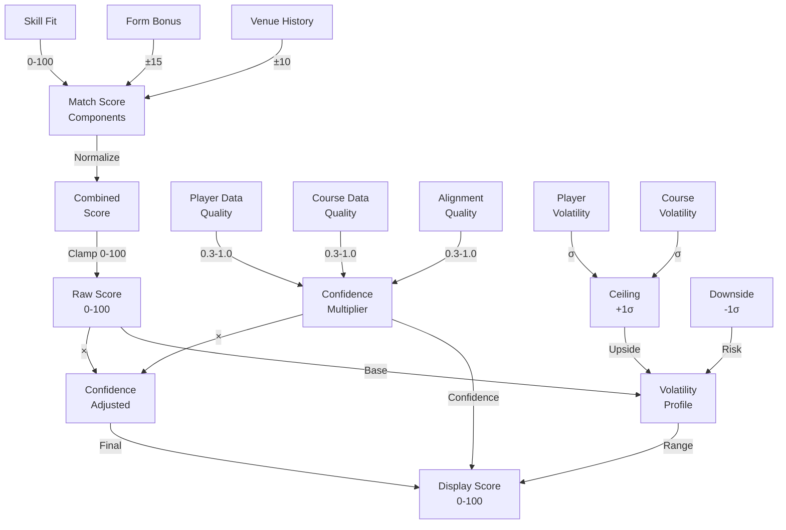

---

## 7. Data Pipeline Architecture

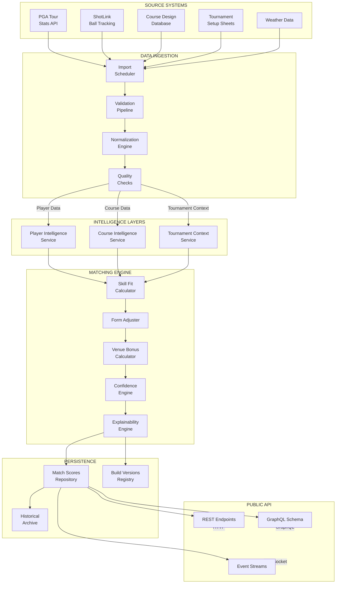

---

## 8. Course Demand Weight Evolution

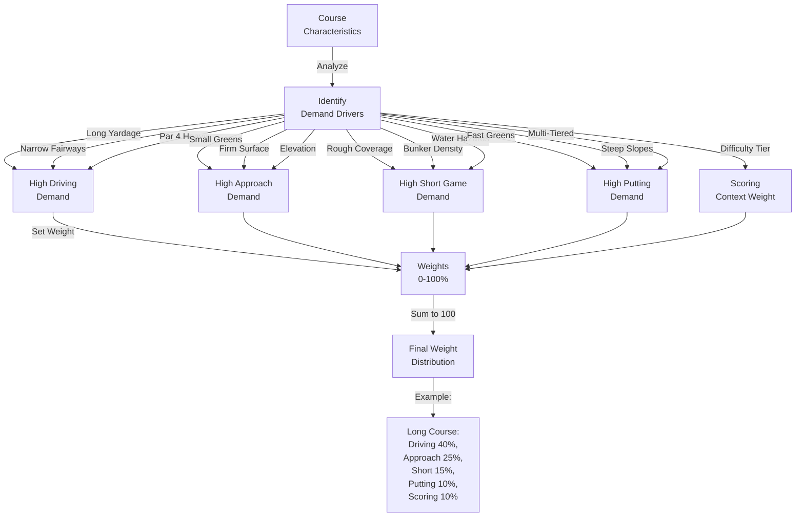

---

## 9. Explainability Pipeline

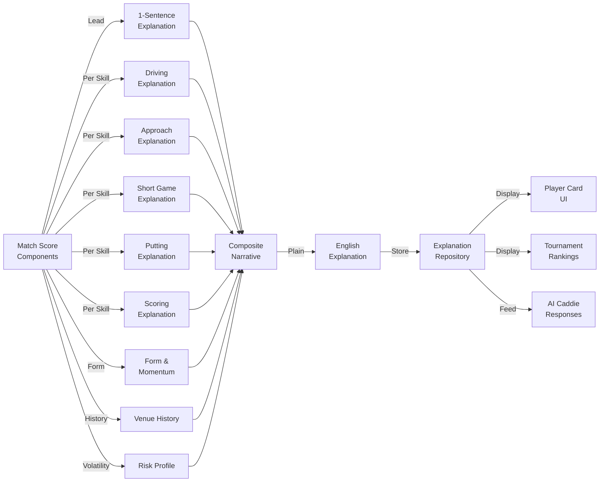

---

## 10. ML Extension Architecture

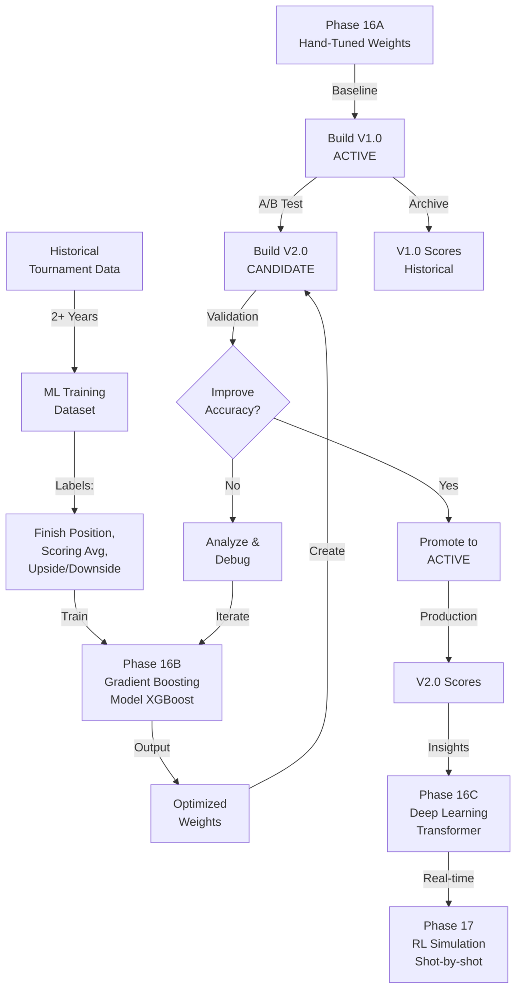

---

## 11. Data Storage Architecture

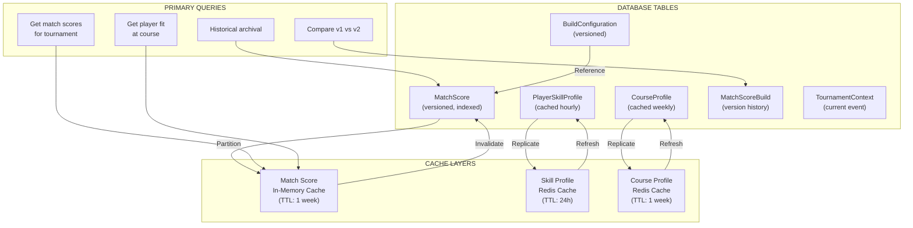

---

## 12. System Context Diagram

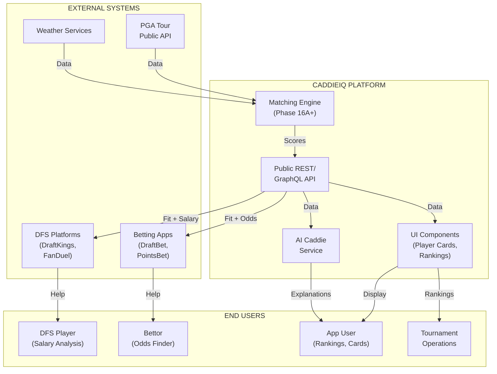

---

**Diagram Summary:**

These 12 diagrams provide:
- **Data Flow:** From sources through intelligence to outputs
- **Calculation:** How match scores are computed
- **Confidence:** How uncertainty is quantified
- **Versioning:** How builds evolve
- **Skill Scoring:** How player-course fit is measured
- **Components:** All pieces of the final score
- **Pipeline:** Complete end-to-end flow
- **Weights:** How course demands drive weighting
- **Explainability:** How narratives are generated
- **ML:** How future AI extends the system
- **Storage:** How data is persisted and cached
- **Context:** How systems interact

All diagrams are Mermaid-renderable and can be converted to images or embedded in documentation.
