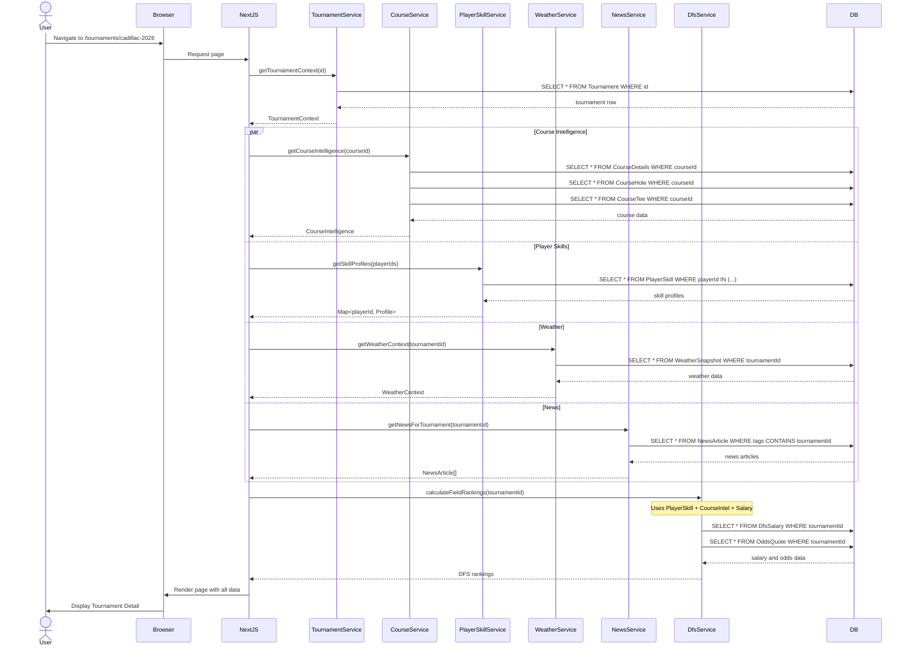
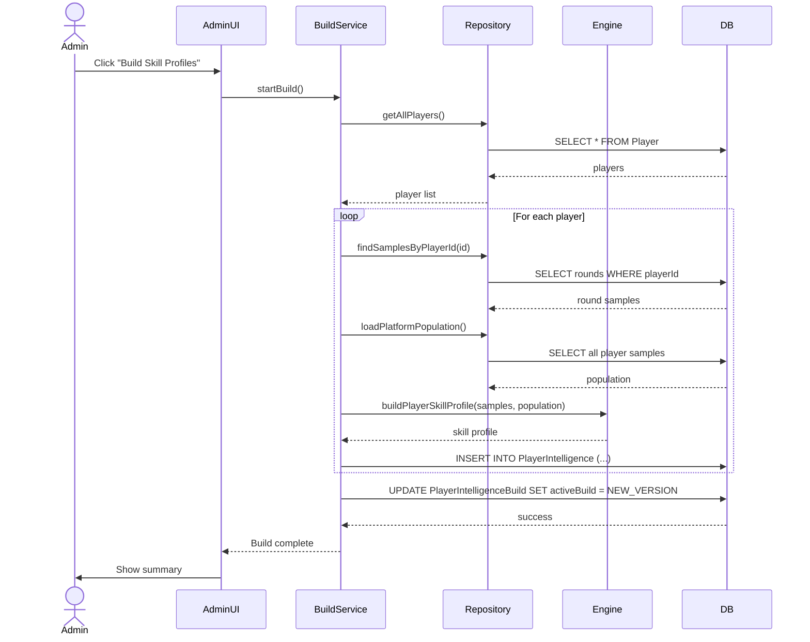
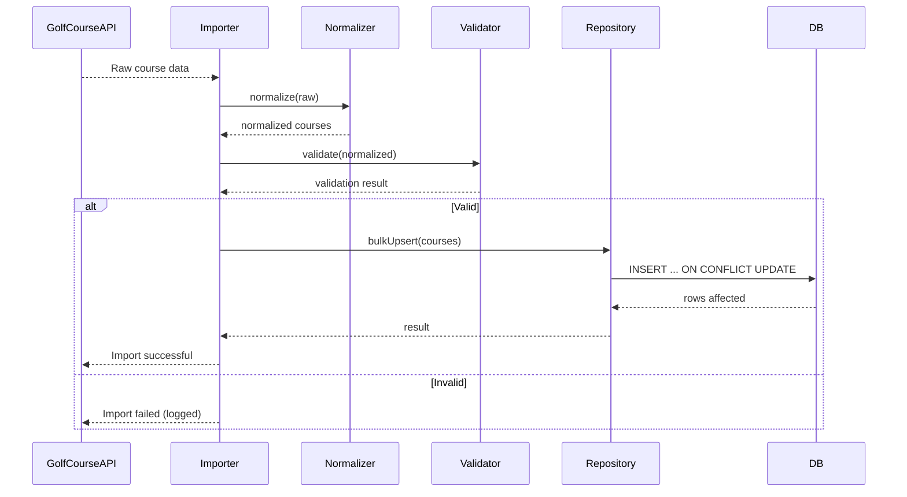
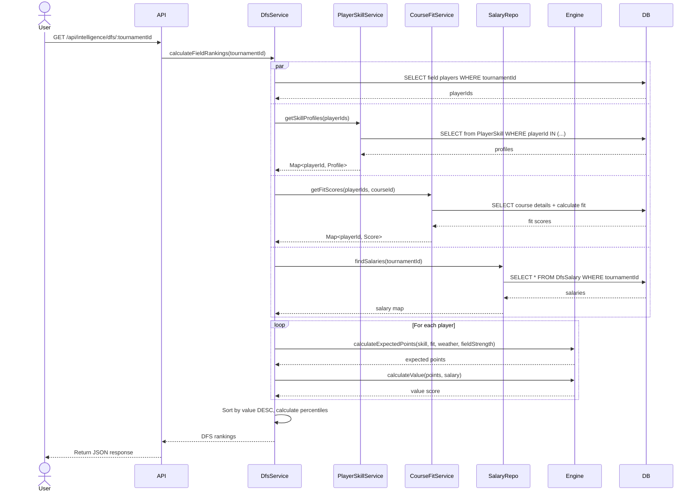
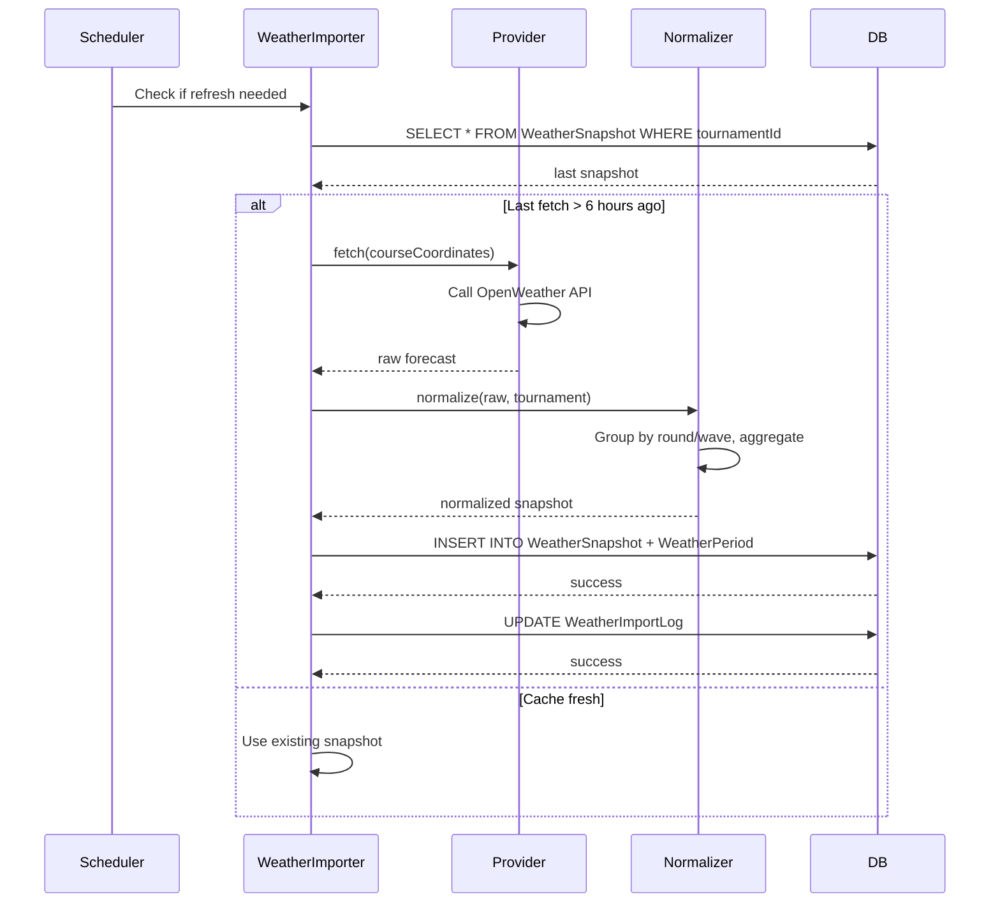
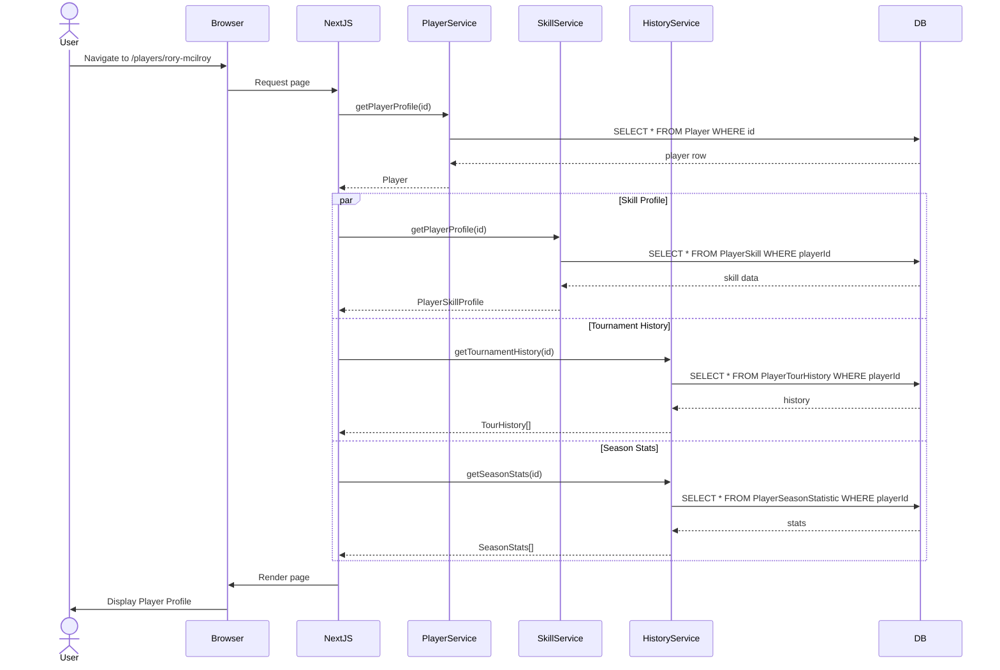
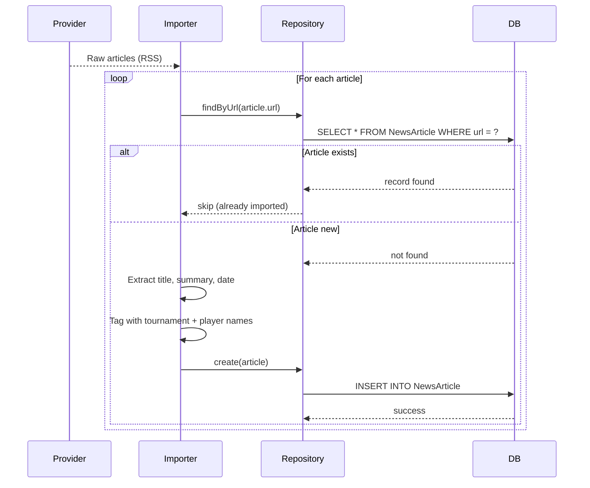

# Sequence Diagrams

**Phase:** 15.3B Documentation

## 1. Tournament Detail Page Load

## 2. Player Skill Profile Build

## 3. Course Import Pipeline

## 4. DFS Value Calculation (Per Request)

## 5. Weather Refresh Cycle

## 6. Viewing a Player Profile

## 7. News Deduplication on Import

